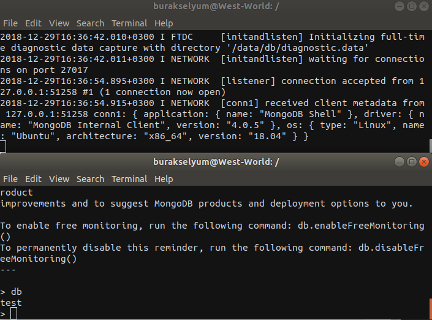
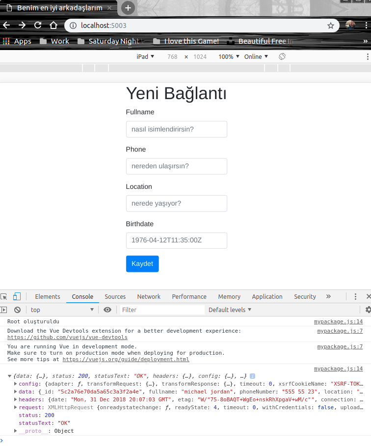
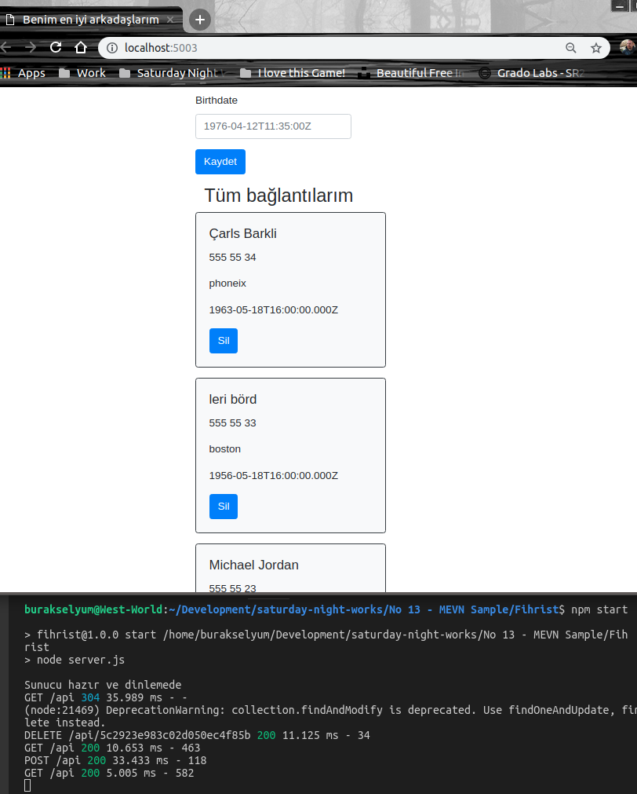

# MongoDb, Express, Vue.js ve Node.js Birlikteliği

Amacım bu 4 enstrümanı kullanarak Web API tabanlı çalışan basit bir web uygulaması geliştirmek. Veriyi tutmak için MongoDB'yi, sunucu tarafı için Node.js'i, Web Framework amacıyla Express'i ve önyüz geliştirmesinde de Vue.js'i kullanmak istedim. Kobay olarakta 90lardan aklıma gelen ve Cobol öğretirlerken gösterdikleri Fihrist örneğini seçtim _(O vakitler sanırım hepimiz öğrendiğim dillerle arkadaşlarımızın telefon numaralarına yer verdiğimiz bir fihrist uygulaması yazmışızdır)_ Özellikle Vue.js tarafında component geliştirmenin nasıl yapılabileceğini, bunlar arasındaki haberleşmenin nasıl tesis edileceğini merak ediyordum. İşin içerisine WebPack ve Babel gibi değişik paketler de girince güzel bir çalışma alanı oluştu.

## Projenin İskeleti

Projenin genel iskelet yapısı ve dosyaları aşağıdaki gibi tesis edilebilir.

```
Fihrist/
|----- app/
       |----- config.js
       |----- Routers.js
       |----- Contact.js
|----- public/
       |----- src/
       |------------ bus.js (vue component'leri arasındaki iletişimi sağlayan event bus dosyası)
       |------------ main.js
       |------------ vue.js (vue npm paketi yüklendikten sonra dist klasöründen alınıp buraya kopyalanmıştır)
       |------------ components/ (vue componentlerini tuttuğumuz yer)
       |----------------- createContact.vue
       |-----------------
       |-----------------
       |----- index.html
|----- server.js
|----- webpack.config.js
```

app klasöründe model sınıf, yönlendirme paketi ve konfigurasyon dosyası yer alıyor. public klasöründe html ve gerekirse css, image gibi asset'lere ve vue uygulamasının kendisine yer vereceğiz. server.js tahmin edileceği üzere node server rolünü üstleniyor.

```
mkdir Fihrist
cd Fihrist
mkdir app
mkdir public
touch server.js
cd public
mkdir src
cd src
mkdir components
```

## Kurulumlar

Sistemde node, npm ve mongodb'nin yüklü olduğunu varsayıyoruz. Kök klasörde,

```
npm init
```

ile başlangıcı yapıp gerekli paket kurulumlarını gerçekleştiriyoruz.

```
npm install body-parser express mongoose morgan method-override
```

Servis mesaj gövdelerini kolayca parse etmek için body-parser, HTTP sunucusu ve servis taleplerinin karşılaması için express, mongodb ile konuşmak için mongoose paketlerinden yararlanmaktayız.

## Uygulamayı Başlatmak için

```
npm start
```

komutunu vermemiz yeterli.

>Mongodb'nin çalışır olduğundan emin olun. Ben bunun için iki terminal penceresi açıp şu yolu izliyorum.

```
mongod
mongo
db
```



Sonrasında web arayüzüne erişerek denemelere başlanabilir.

## Servis Testleri

Servis tarafının işlerliğini kontrol etmek için CURL ile aşağıdaki denemeler yapılabilir. 4 tane insert, ardından tüm listenin çekilmesi, sonrasında belli bir id'ye bağlı kontak bilgisinin alınması, derken bir güncelleme ve son olarak da silme operasyonlarını icra etmekteyiz.

```
curl -H "Content-Type: application/json" -X POST -d '{"fullname":"M.J.","phoneNumber":"555 55 23","location":"chicago","birtdate":"1963-05-18T16:00:00Z"}' http://localhost:5003/api

curl -H "Content-Type: application/json" -X POST -d '{"fullname":"Çarls Barkli","phoneNumber":"555 55 34","location":"phoneix","birtdate":"1963-05-18T16:00:00Z"}' http://localhost:5003/api

curl -H "Content-Type: application/json" -X POST -d '{"fullname":"meycik cansın","phoneNumber":"555 55 32","location":"los angles","birtdate":"1959-05-18T16:00:00Z"}' http://localhost:5003/api

curl -H "Content-Type: application/json" -X POST -d '{"fullname":"leri börd","phoneNumber":"555 55 33","location":"boston","birtdate":"1956-05-18T16:00:00Z"}' http://localhost:5003/api

curl http://localhost:5003/api

curl http://localhost:5003/api/5c29222522433f0234e71e1b

curl -H "Content-Type: application/json" -X PUT -d '{"id":"5c29222522433f0234e71e1b","fullname":"maykıl cordın"}' http://localhost:5003/api

curl -X DELETE http://localhost:5003/api/5c29222522433f0234e71e1b

```

>ID değeri elbette siz denerken farklılık gösterecektir.

## Front-End Tarafı

Tüm front-end enstrümanları public klasörü altında konuşlanmış durumda. Javascript ve css asset'lerini tek bir javascript içerisine paketlemek için WebPack'ten yararlanılıyor. Vue tarafındaki HTTP çağrıları için istemci olarak axios'tan yararlanılıyor. Bunların kurulumları için terminalden şöyle ilerlenebilir.

```
npm install babel-core babel-loader@7 babel-preset-env babel-preset-stage-3 css-loader vue-loader vue-template-compiler webpack webpack-dev-server bootstrap
```

Frontend tarafı geliştmeleri bittikten sonra bir build işlemi ile mypackage.js'i oluşturuyoruz. Tabii burada webpack.config.js dosyasına da ihtiyaç var.

```
npm run build
```

Eğer sorunsuz bir şekilde _(sorunsuz diyorum çünkü webpack.config.js dosyasını ayarlarken epey vakit kaybedip sorun yaşadım)_ Fihrist'in altında dist/public/build/mypackage.js şeklinde bir dosya oluşacaktır. Bu bohçayı index.html public klasörüne alıp index.html içerisinden kullanıma açabiliriz.

Test etmek için node ve mongodb sunucularını çalıştırmamız ve http://localhost:5003/ adresine gitmemiz yeterli. Malum burası varsayılan olarak index.html'e yönlendiriyordu. index.html içinde de Vue kodlarımızı paketlediğimiz mypackage.js dosyamız olduğundan ilgili template'lerin buraya yüklenmesi gerekiyor.

>Build işlemi sonrası bileşenlerden bir değişiklik yapılırsa tekrardan build işleminin çalıştırılması ve bundle paketinin kullanıma alınması gerekir.

Ekleme işlemi ile ilgili ilk test sonucu aşağıdaki gibidir.



Listeleme ve listenen bağlantıları silme işini contacts.vue isimli bileşen üstlenmekte. Buda app.vue içerisinde tanımlanıp sayfaya yerleştiriliyor. contacts.vue içerisinde bootstrap card'ları kullanmayı tercih ettim. Çok berbat bir tasarım olmadı ama çok iyi de olmadı. Fonksiyonel olarak bağlantıları listeletebiliyor, silme ve yenilerini ekleme işlemlerini gerçekleştirebiliyoruz.

>Update işlemi içinde buraya bir şeyler eklemek lazım. Bunu kendinize ödev edinebilirsiniz.

contacts.vue kodlaması tamamlandıktan sonra bir kaç test yaptım. Hatalarımı düzelttim. Pek tabii öncesinde webpack build işlemini yeniden çalıştırmak gerekiyor ki son güncellemelerimiz de pakete yansısın. İşte örnek bir ekran görüntüsü.



## Tepeden Aşağıya

Olayın başlangıç noktası olan index.html son derece sadedir. İçinde vue bileşenlerimiz, bootstrap ve vue.js gibi gerekli diğer kütüphaneleri barındırmaktadır. Vue kodları event bus ve api servislerini kullanarak arayüzün model ile olan ilişkisinde rol alır ve temel CRUD operasyonlarına izin verir.  

## Neler Öğrendim

- Vue'da component nasıl geliştirilir
- template üzerinde model kullanımı nasıldır
- axios ile HTTP Post,Get,Put gibi metodlar nasıl çağrılır
- webpack.config dosyası nasıl hazırlanır
- bir bileşenden event bus'a bildirim nasıl yapılır ve diğer bileşenlerden bu değişiklik nasıl yakalanır
- Bootstrap Card'ları nasıl kullanılır