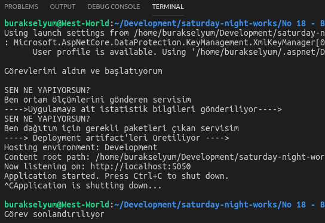

# AspNet Core Web Api'lerde Background Task Kullanımı

AspNet Core uygulamalarında IHostedService türevli tipleri kullanarak arka plan hizmetleri çalıştırabiliyoruz. Bu sayede uygulamanın yaşamı boyunca çalışmasını istediğimiz bir takım periyodik işleri arka plan servislerine devredebiliriz. Amacım IHostedService türevli tipleri anlamaya çalışmak ve arka plan görevlerini icra ettirmek. Ben ilk iki görevi yapmaya çalıştım. 

1. Zamanlayıcıya bağlı arka plan görevlerini icra ettiren servisimiz IHostedService'in en ilkel uygulanan şablonu. 
2. İkinci örnekteki hosted service, ilgili arka plan görevlerini içeren daha kapsamlı servisleri kullanılıyor. Bu servisler _(Scoped Service olarak ifade edebiliriz)_ Dependency Injection yardımıyla HostedService'e geçiyorlar.
3. Arka plan işleri bir sıraya göre kuyruklandırılarak değerlendiriliyor. _(İlerleyen zamanlarda tekrar değerlendirilecek)_

## Birinci Örnek _(GarbageHostService)_

İlk olarak bir .net core web api uygulaması oluşturulur.

```
dotnet new webapi -o ManagerApi
cd ManagerApi
mkdir Services
cd Services
touch GarbageHostService.cs
```

Ardından IHostedService türevli sınıf içeriği yazılır ve Startup dosyasında gerekli değişiklikler yapılır.

## Çalışma Zamanı

Uygulamayı başlatmak için terminalden aşağıdaki komutu vermemiz yeterlidir.

```
dotnet run
```


Kodların çalışma sırasına dikkat edelim. Konfigurasyon dosyasındaki değerelere göre belli bir zaman aşımı noktasına gelindiğinde gerekli Task metodu icra ediliyor. Örnek uydurulmuş bir Cache temizleme işlemini icra etmekte.

## İkinci Örnek _(GarbageConsumerHostService.cs)_

```
cd ManagerApi
cd Services
touch ITaskContractService.cs
touch StatisticTaskService.cs
touch PrepareArtifactService.cs
touch CommonHostedService.cs
```

İş yapan görevleri içeren sınıflar StatisticTaskService ve PrepareArtifactService. Her ikisi de görevlerle ilgili sözleşmelerini ITaskContractService interface tipinden devralıyorlar. HostedService görevini ise CommonHostedService sınıfı üstleniyor. 

>Bu örnekte amaç, asıl görev servislerini Startup safhasında Dependency Injection yardımıyla HostedService örneğine enjekte edebilmek.

## Çalışma Zamanı

```
dotnet run
```



## Neler Öğrendim?

- En ilkel haliyle arka plan işlerini zamanlayıcı bağımlı çalıştıran bağımsız bir servisin nasıl yazılabileceğini
- IHostedService arayüzünden gelen metodların ne işe yaradığını
- Dependency Injection yardımıyla birden fazla background servis'in nasıl ele alınabileceğini