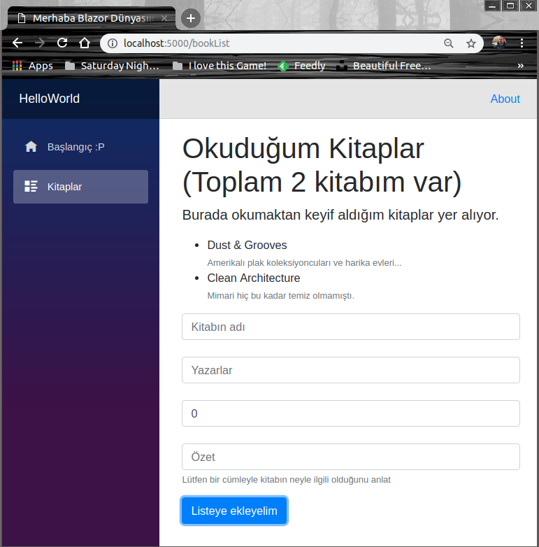
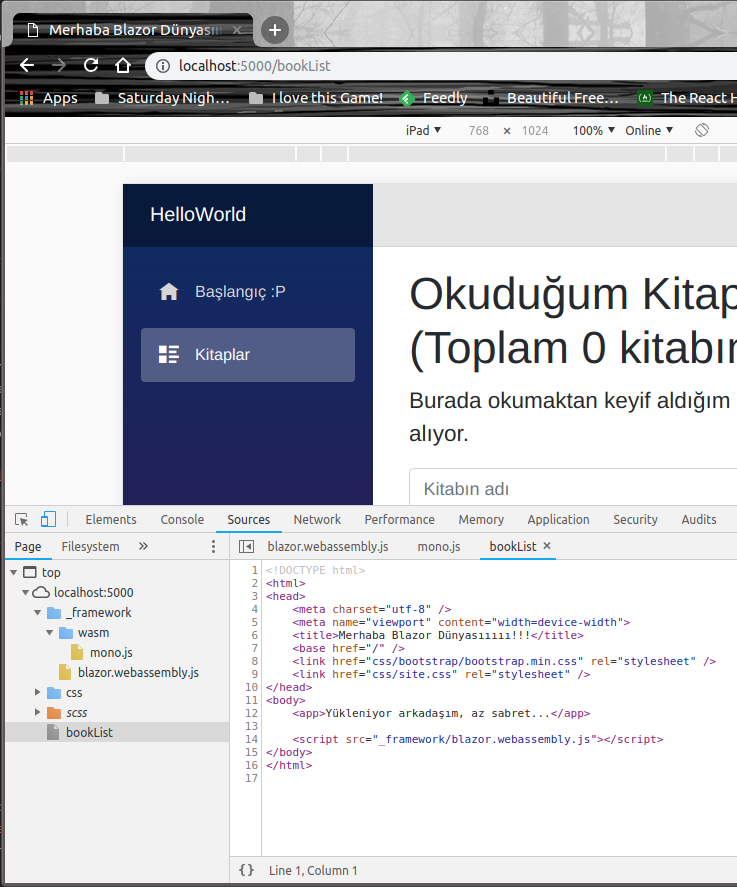
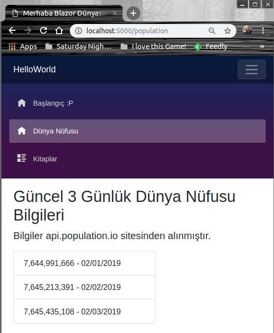

# Blazor ile Hello World Uygulaması Geliştirmek

Amacım Microsoft'un deneysel olarak geliştirdiği Blazor çatısı _(Web Framework)_ ile C#/Razor _(Razor HTML markup ve C#'ın bir arada kullanılabildiği syntax olara düşünülebilir. Bu sayede C# ve HTML kodlamasını aynı dosyada intellisense desteği ile ele alabiliriz)_ ,HTML ve WebAssembly tabanlı web uygulamalarının nasıl geliştirilebileceğini Hello World diyerek deneyimlemek. Blazor ile geliştirilen uygulamalar WebAssembly desteği ile browser üzerinde koşuyor. WebAssembly, yüksek performanslı web uygulamaları geliştirilmesindeki öncü akımlardan. İlk hedef basit bir uygulamayı inşa edip ayağa kaldırabilmek, temel bileşenleri anlamaya çalışmak.

>Blazor, .Net ile geliştirilmiş Single Page Application'ların, WebAssembly desteği yardımıyla tarayıcı üzerinde çalışmalarına olanak sağlayan bir Web Framework olarak düşünülebilir.

.Net'i Browser üzerinde kullanabilmek. İşte bütün mesele bu :) Bir .Net kodunu tarayıcı üzerinde çalıştırmanın yolu yeni nesil teknolojilerden olan wasm'ı _(WebAssembly)_ kullanmaktan geçiyor. Client Side ve Serve Side Hosting modelleri söz konusu. Client-Side modelinde, C#/Razor ile geliştirilip derlenen .Net Assembly'ları, .Net Runtime'ı ile birlikte tarayıcıya indiriliyor. Sunucu bazlı modele bakıldığında, Razor component'leri sunucu tarafında konuşlanırken UI, Javascript ve olay _(event)_ çağrıları için SignalR devreye giriyor. 

Esasında uygulamalar Component bazlı geliştirilmekte. Bir component bir C# sınıfıdır ve Blazor açısından bakıldığında genellikle bir cshtml dosyasıdır. _(Elbette bir C# dosyası da olabilir)_

>WebAssembly koduna derlenen uygulamalar herhangibir tarayıcıda yüksek performansla çalışabilirler.

## Gereksinimler

Pek çok kaynak konuyu Visual Studio üzerinde incelemekte. Orada bir Web projesi açarken şablon kısmında Blazor'u seçmek yeterli. Ancak ben yabancı topraklardayım ve West-World'de Linux ile en yakın arkadaşı Visual Studio Code var. Bu nedenle işe aşağıdaki gibi başlamak gerekiyor.

```
dotnet new --install "Microsoft.AspNetCore.Blazor.Templates"
dotnet new blazor -o HelloWorld
```

Öncelikle blazor için gerekli proje şablonunu indiriyoruz. Ardından blazor tipinden hazır bir proje iskeletini oluşturuyoruz.

>Hemen ilgili klasöre girip _dotnet run_ ile uygulamayı çalıştırıp deneyebiliriz. Uyguluma localhost:5000 numaralı porttan hizmet verecektir. 

## Notlar

Sayfaları incelemekte yarar var. Index, Counter ve FetchData _(Dependency Injection kullanılan örnek)_ yönlendirmeleri sonrası çalışan aynı isimli cshtml içeriklerine odaklanmak gerekiyor. Söz gelimi Counter sayfasında düğmeye bastıkça sayaç değeri artmakta. Ancak bu gerçekleşirken sayfa yeniden yüklenmiyor ki bunun için normalde Client-Side Javascript kodunun yazılması gerekir. Olaya Blazor açısından baktığımızda, kodlamanın Javascript değil de C# ile yapıldığını fark etmek lazım. 

İlgili sayfada oynayarak farklı sonuçlar elde etmeye çalışabiliriz _(Ben hemen bir kaç değişiklik yapıp konuyu anlamaya çalıştım)_


>CSS tarafında bootstrap hazır olarak geliyor. Sol taraftaki navigation menu'yü kurcalamak istersek, Shared klasöründeki NavMenu.cshtml ile oynamak yeterli. Her şeyin giriş noktası olan index.html içerisinde, blazor.webassembly.js isimli javascript dosyası için bir referans var _(Bu niye var öğrenmek lazım)_

## Dependency Injection Kullanımı

Blazor doğal olarak DI mekanizmasını destekler ve built-in servisler haricinde kendi servislerimizinde içeriye DI mekanizması ile alınmasına olanak sağlar _(hatta buna zolar)_ Söz gelimi HttpClient gibi built-in bir servisi client-side Razor tarafına enjekte edip kullanabiliriz. IJSRuntime, IUriHelper gibi bir çok yararlı built-in servis bulunmakta. Kendi servislerimizi de _(söz gelimi bir data repository için kullanılabilecek tipleri)_ DI ile sisteme dahil etmemiz mümkün. Aynen .Net Core'da olduğu gibi ConfigureServices metoduna gelen IServicesCollection arayüzünden yararlanmalıyız. 

```
services.AddSingleton<IMessenger, SMSMessenger>();
```

gibi...

## Yapılanlar

- Pages klasörüne Book.cshtml isimli bir dosya eklendi.
- NavMenu.cshtml içeriği ile birazcık oynandı.
- Kitapları temsil eden book sınıfı eklendi.
- Counter.cshtml kurcalandı ve değiştirildi.
- DI örneği için ProductList.cshtml eklendi.

## Çalışma Zamanı

```
dotnet run
```

Örnek olarak bir iki kitap girip sonuçları görebiliriz.



bookList.cshtml içeriği tarayıcıda aşağıdaki gibi oluşur.



Built-In HttpClient servisini enjekte ettiğimiz dünya nüfus verileri sayfası.



## Paketleme

Blazor uygulamasının dağıtımı için publish işlemini yapmamız gerekiyor. Visual Studio ile bu kolay. Azure'a servis olarak bile alabiliriz. West-World gibi Ubuntulu ortamlarda da komut satırından işlemler yapılabilir.

```
dotnet publish -c Release
```

>Oluşan dosya içeriklerini incelemekte yarar var. publish operasyonu sırasında gereksiz kütüphaneler çıkartılıp paket boyutu mümkün mertebe küçültülüyor. Dikkat çekici nokta C# kodunun çalışması için gerekli ne kadar runtime bileşeni _(mscorlib, mono runtime, c libraries vb)_ varsa mono.wasm içine konulması. West-World'teki örnekten bu 2.1 mb'lık dosya anlamına geldi.

Bunun sonucu olarak bin/Release/netstandard2.0/publish/ klasörü altına gerekli proje dosyaları atılır. Bu dosyaları web sunucusuna veya bir host service'e alarak _(manuel veya otomatik araçlar yardımıyla)_ uygulamayı canlıya alabiliriz.

## Neler Öğrendim

- Bir Blazor proje şablonunun temel bileşenlerini.
- Blazor tarafında Bootstrap kullanıldığını.
- Razor'da sayfa bileşenleri ile fonksiyonların nasıl etkileşebileceğini.
- Blazor'daki Dependency Injection yapısını.
- Component'lerin ne işe yaradığını.
- Kabaca WASM terimini. 