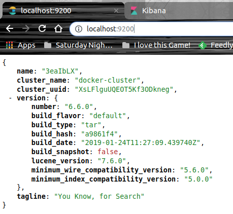
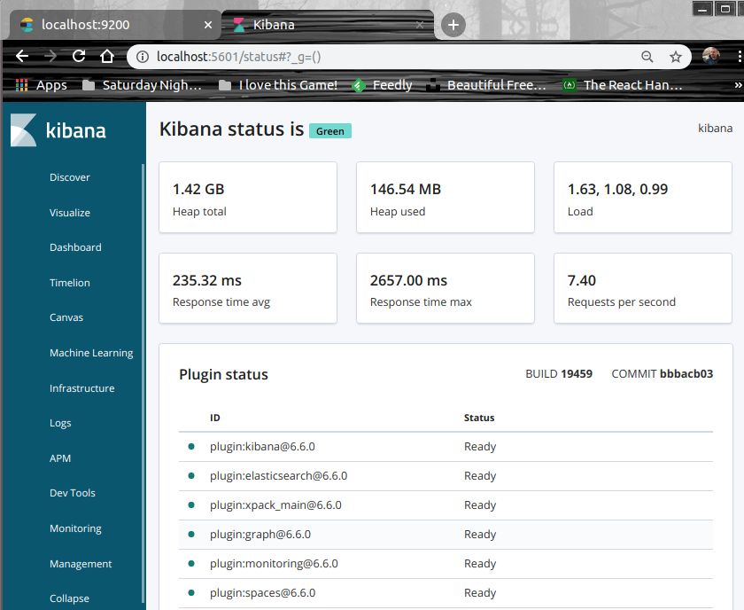
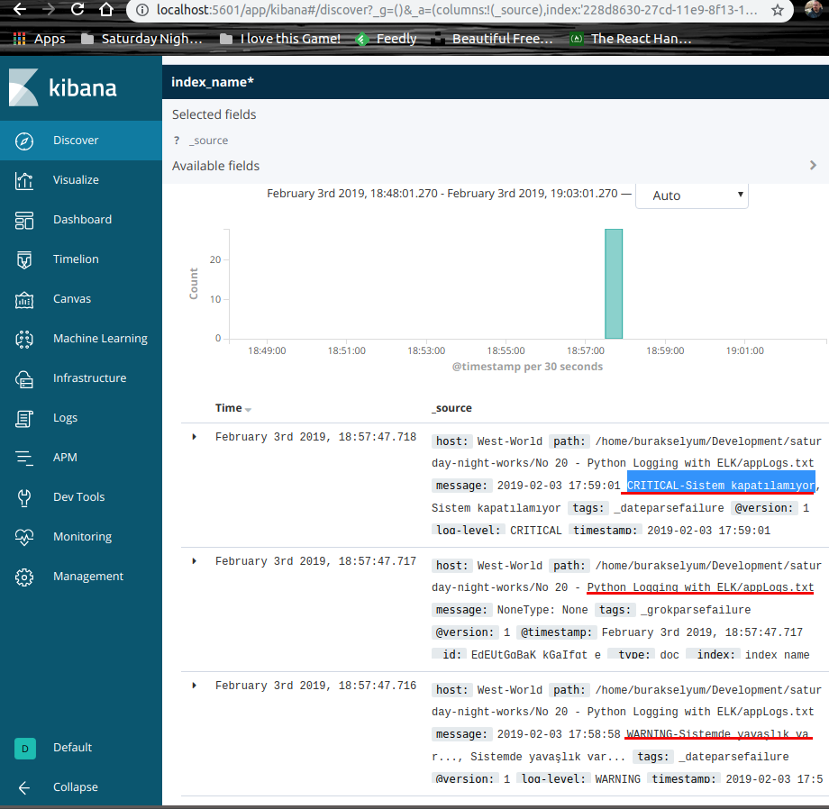

# Python Loglamada ELK Kullanımı

ELK yani Elasticsearch, Logstash ve Kibana üçlüsü. Microservis'lerde log stratejisi olarak sıklıkla kullanılıyorlar. Uygulamaların log bilgileri logstash tarafından dinlenip JSON formatına dönüştürülüyor ve Elasticsearch'e basılıyor. Elasticsearch'e alınan log'lar Kibana arayüzü ile izleniyor. Benim amacım ELK üçlüsünü WestWorld'de _(Ubuntu 18.04, 64bit)_ deneyimlemek ve loglama işini yapan uygulama tarafında basit bir Python kodunu kullanmak. WestWorld'ün uzun denemeler sonrası bozulan ekosistemini daha da dağıtmak istemediğimden Elasticsearch ve Kibana tarafı için Docker Container'larını kullanmak istiyorum. Kabaca aşağıdaki gibi bir senaryo söz konusu.


## Ön Gereklilikler

Pek tabii bazı gereksinimlerimiz var. Bunları aşağıda maddeleştirdik.

### Elasticsearch ve Kibana Tarafı

Elasticsearch'ün Docker kurulumu ve başlatılması için,

```
docker pull docker.elastic.co/elasticsearch/elasticsearch:6.6.0
docker run -p 9200:9200 -p 9300:9300 -e "discovery.type=single-node" docker.elastic.co/elasticsearch/elasticsearch:6.6.0
```

Kibana'ya ait Docker imajı için,

```
docker pull docker.elastic.co/kibana/kibana:6.6.0
sudo docker run --net=host -e "ELASTICSEARCH_URL=http://localhost:9200" docker.elastic.co/kibana/kibana:6.6.0
```

Elasticsearch ve kibana container'ları çalıştırıldıktan sonra aşağıdaki adreslere gidip etkinleştirildiklerini kontrol etmekte yarar var.

```
http://localhost:9200/ -> Elasticsearch
http://localhost:5601/status -> Kibana
```





### Logstash Tarafı

Logstash tarafı için öncelikle [şu](https://www.elastic.co/downloads/logstash) adresten ilgili içeriği indirip kurmak gerekiyor. _(Docker imajı yerine tercih ettim)_ Bundan sonra python uygulamamızın ürettiği log dosyasını takip etmesi için aşağıdaki içeriğe sahip bir konfigurasyon dosyasına ihtiyacımız var. Dosyayı etc/logstash/conf.d altına oluşturuyoruz. Bu klasör içerisindeki conf uzantılı dosyalar logstash servisi tarafından takip edilirler. Böylece logstash hangi logları takip edeceğini bilir ve onları Kibana tarafına gönderir.

>Bu ve benzeri konfigurasyon dosyalarının logstash servisi tarafından otomatik olarak ele alınabilmesi için etc/logstash/conf.d klasörü altında konuşlandırılmaları önemli.

logstash-python.conf

```
input{
 file{
 path => "/home/burakselyum/Development/saturday-night-works/No 20 - Python Logging with ELK/appLogs.txt"
 start_position => "beginning"
 }
}
filter
{
 grok{
 match => {"message" => "%{TIMESTAMP_ISO8601:timestamp} %{LOGLEVEL:log-level}-%{GREEDYDATA:message}"}
 }
    date {
    match => ["timestamp", "ISO8601"]
  }
}
output{
 elasticsearch{
 hosts => ["localhost:9200"]
 index => "index_name"}
stdout{codec => rubydebug}
}
```

path özelliğinin değeri logstash'in izleyeceği dosyayı belirtir. grok elementinin içeriği de önemlidir. Nitekim text dosyası içerisine atılan standart log mesajlarını nasıl yakalayacağına dair bir desen içerir. Kısacası Grok filtreleme aracı ile text dosyaları gibi hedeflere atılan unstructured log bilgilerini parse etmek oldukça kolaydır. Sistem logları, Apache logları, SQL logları vb bir çok sistemin loglama yapısı buradaki desenlere uygundur zaten.

## Çalışma Zamanı

En az bir kereliğine de olsa main.py dosyasını çalıştırmak lazım.

```
python3 main.py
```

Logstash servisinin aktif olduğundan emin olmak gerekiyor ki yazılan log'lar takip edilsin. Logstash servisini başlatmak için terminalden

```
service logstash service
```

komutunu çalıştırmak yeterli.

### Kibana Monitoring

logstash etkinleştirildikten sonra Kibana'ya gidip yeni bir index oluşturabiliriz. index_name* ve @timestamp field'ını seçerek ilerlediğimizde python uygulaması tarafından üretilen logların yakalandığını görürüz.



>Visualize kısmını kurcalayarak çeşitli tipte grafikler hazırlayıp Dashboard'u etkili bir monitoring aracı haline dönüştürebiliriz.

## Docker

Testler sonrası Docker tarafında ihtiyaç duyabileceğimiz komutlar da olabilir. Söz gelimi Container'ların listesini görmek ve durdurmak için aşağıdaki komutlardan yararlanabiliriz. _(Container ID'ler farklılık gösterecektir)_

```
sudo docker ps -a
sudo docker stop 3402e6aaced3
```

## Neler Öğrendim?

- ELK üçlemesinin nasıl bir çözüm sunduğunu
- Microservice tarafında nasıl kurgulanabileceklerini
- Ubuntu platformunda Docker imajlarından nasıl yararlanılabileceğini