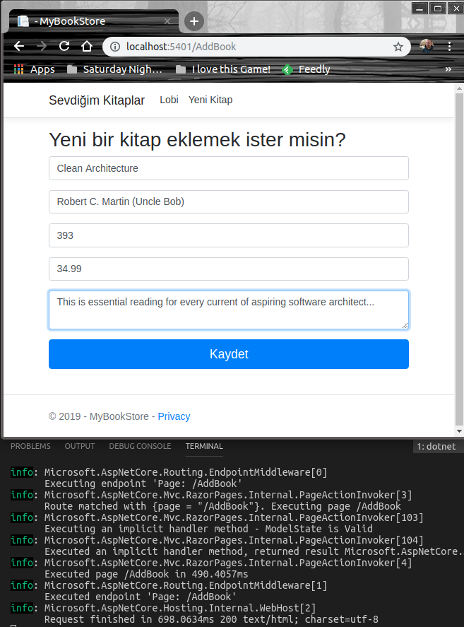
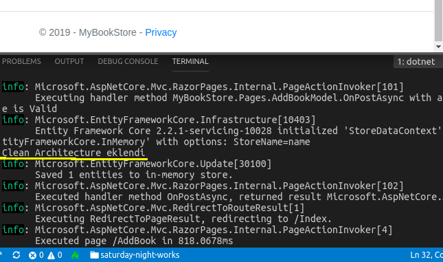
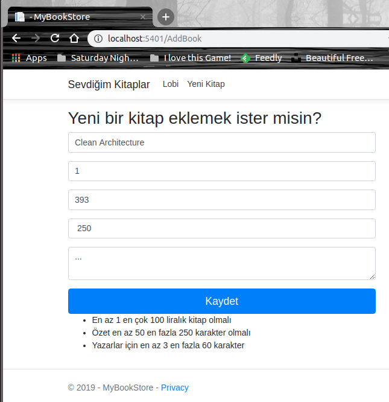

# Razor Dünyasına Atılan İlk Adımlar

Amacım, Microsoft'un Asp.Net Core MVC tarafında özellikle sayfa odaklı senaryolar için geliştirdiği Razor çatısını tanımak. Bu çatıda sayfalar doğrudan istemci taleplerini karşılayıp arada bir Controller'a uğramadan sayfa modeli _(PageModel)_ ile konuşabiliyorlar. Razor sayfaları SayfaAdı.cshtml benzeri olup kullandıkları sayfa modelleri SayfaAdi.cshtml.cs şeklinde oluşturuluyorlar. Genel hatları ile URL eşleştirmeleri aşağıdaki gibi oluyor.

| Örnek Url Adresi                            | Karşılayan Razor Page         | PageModel                        |
|---------------------------------------------|-------------------------------|----------------------------------|
| /Book                                       | pages/Book.cshtml             | pages/book.cshtml.cs             |
| /Category/Product                           | pages/Category/Product.cshtml | pages/Category/Product.cshtml.cs |
| /Category  (Yandaki gibi de tasarlanabilir) | pages/Category/Index.cshtml   | pages/Category/Index.cshtml.cs   |
| /Category/Index                             | pages/Category/Index.cshtml   | pages/Category/Index.cshtml.cs   |
| /Index                                      | pages/Index.cshtml            | pages/Index.cshtml.cs            |
| /                                           | pages/Index.cshtml            | pages/Index.cshtml.cs            |

>Çalışmada veri girişi yapılabilen basit bir form tasarlayıp, Razor'un kod dinamiklerini anlamak istiyorum. Veriyi InMemory veritabanında tutmayı planlıyorum.

## Başlangıç

Örneği West-World _(Ubuntu 18.04 64bit)_ üzerinde deniyorum. Linux tarafında Razor uygulamalarını oluşturmak için .Net Core 2.2'ye ihtiyacımız var. Kodları geliştirmek içinse Visual Studio Code'dan yararlanabiliriz. Projeyi oluşturmak için aşağıdaki komutu vermek yeterli.

```
dotnet new webapp -o MyBookStore
```

Oluşan uygulama iskeletini incelersek Razor sayfaları ve ilişkili model sınıflarının Pages klasöründe konuşlandırıldığını görürüz. Static HTML dosyaları, javascript kütüphaneleri ve CSS içerikleri de wwwroot altında tutulur.

## Yapılan Geliştirmeler

- Data klasörü oluşturulup StoreDataContext.cs ve Book.cs dosyaları eklendi. _(Entity tarafı)_
- Pages klasörü altına AddBook.cshtml ve AddBook.cshtml.cs dosyaları eklendi. _(Razor Page ve PageModel tarafı)_
- Varsayılan olarak gelen Index.cshtml ve Index.cshtml.cs içerikleri değiştirildi.
- _Layout.cshtml içeriği değiştirildi.

## Çalışma Zamanı

Uygulamayı 

```
dotnet run
```

komutuyla çalıştırdıktan sonra http://localhost:5401/ adresi üzerinden test edebiliriz. İster üst bara eklediğimiz linkten ister http://localhost:5401/AddBook adresine giderek yeni kitap ekleme sayfasına ulaşabiliriz.

>In Memory veritabanı kullandığımız için uygulama sonlandığında tüm kayıtlar uçacaktır. Kalıcı bir Repository için SQL, SQLite ve benzeri sistemleri içeriye enjekte etmeyi deneyebilirsiniz.

Uncle Bob temalı örnek bir kitap verisini ilk denemede kullanabilirsiniz.

```
Clean Architecture
Robert C. Martin (Uncle Bob)
393
34.99
"This is essential reading for every current of aspiring software architect..."
```





Validasyona takılabiliriz de...



Başarılı girişler sonrası gelinen Index sayfasının çıktısı ise,

## Neler Öğrendim?

- Razor Page ve Page Model kavramlarını
- Razor'un temel çalışma prensiplerini
- Yönlendirmelerin _(Routing)_ nasıl işlediğini
- Razor içinden model nesnelerine nasıl bağlanılabileceğini _(property binding)_
- Entity Framework Core'da InMemory veritabanı kullanımını
- Çeşitli DataAnnotations niteliklerini _(attributes)_