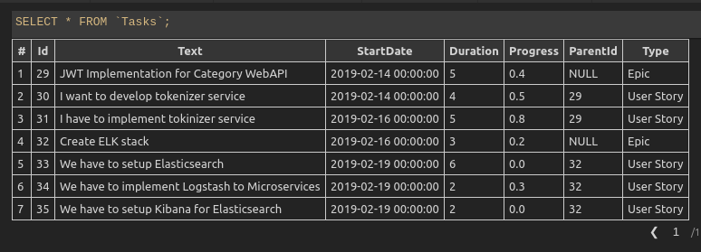
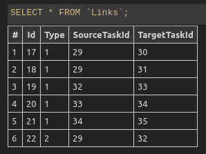
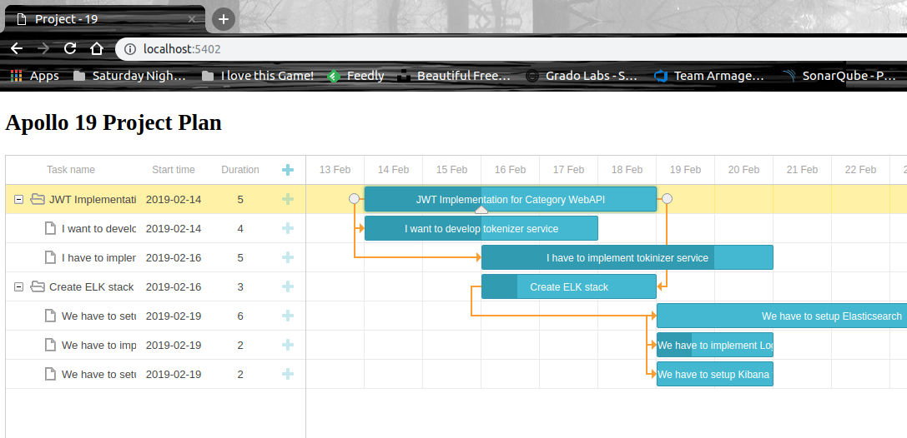
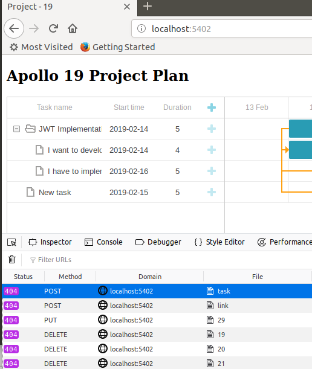

# dhtmlxGantt Kütüphanesi ile AspNet Projesinde Gantt Chart Kullanımı

Henry Gantt tarafından icat edilen Gantt tabloları, proje takvimlerinin şekilsel gösteriminde kullanılmaktadır. Temel olarak yatay çubuklardan oluşan bu tablolarda proje planlarını, task'ları, süreleri ve ilerleyişi görmek mümkündür. Excel üzerinde bile kullanılabilen Gantt Chart'lar sanıyorum proje yöneticilerinin de vazgeçilmez araçlarındandır. Benim amacım ise dhtmlxGantt isimli Javascript kütüphanesinden yararlanarak bir Asp.Net Core projesinde Gantt Chart kullanmak. 

## Hazırlıklar

Uygulamayı her zaman olduğu gibi WestWorld'de _(Ubuntu 18.04 64bit)_ deniyorum. İlk olarak boş bir web uygulaması oluşturarak işe başlayabiliriz. Ardından wwwroot klasörünü ekleyip içerisine index.html dosyasını ekliyoruz.

```
dotnet new web -o ProjectManagerOZ
```

>Örnekte kullanılan ve gantt chart çizimi için kullanılan CSS dosyasına [şu adresten](https://cdn.dhtmlx.com/gantt/edge/dhtmlxgantt.css), Javascript dosyasına da [buradaki](https://cdn.dhtmlx.com/gantt/edge/dhtmlxgantt.js) adresten ulaşabilirsiniz. Bu kaynakları offline çalışabilmek için bilgisayara indirim wwwroot altında konuşlandırdım.

## Yapılanlar

- wwwroot klasörüne index.html eklendi _(dhtmlxGantt'ın öngördüğü varsayılan index.html kullanıldı)_
- Program.cs ve Startup.cs içeriklerinde değişiklik yapıldı.
- SQLite veritabanını tutmak için db klasörü oluşturuldu.
- Models klasörü açıldı ve içerisine ApolloDataContext, Link, Task sınıfları eklendi.
- Initializers klasörü açıldı ve içerisine DataFiller, DataFillerExtension sınıfları eklendi.
- dto klasörü açıldı ve içerisinde LinkDTO ile TaskDTO sınıfları eklendi _(Data Transform Object sınıflarımız olarak düşünülebilirler)_
- Controllers klasörü oluşturuldu ve içerisinde ana sayfa, Task ve Link için gerekli Controller tipleri eklendi.

>Sınıfların ne işe yaradığı içlerindeki yorum satırlarında mevcuttur.

## SQLite Kullanabilmek için

SQLite kullanımı için EntityFramework Core'un ilgili NuGet paketini projeye eklemek lazım.

```
dotnet add package Microsoft.EntityFrameworkCore.SQLite
```

Ardından appsettings.json dosyasına bir Connection String bildirimi dahil edip, Startup sınıfındaki ConfigureServices metodunda minik bir ayarlama gerekiyor. Bunlar başlangıç aşamasında yeterli değil. Nitekim SQLite veritabanının oluşturulması da gerekiyor.

```
dotnet ef migrations add InitialCreate
dotnet ef database update
```

sayesinde DataContext türevli sınıf baz alınarak migration planları çıkartılır. Planlar hazırlandıktan sonra ikinci komut ile update planı yürütülür ve ilgili tablolar SQLite veritabanı içerisine ilave edilir.


## Çalışma Zamanı

Kod ilk çalıştırıldığında eğer Tasks tablosunda herhangibir kayıt yoksa aşağıdaki gibi 3 satır oluşturulacaktır.



Benzer şekilde Links tablosunda da ilgili bağlantılar tesis edilecektir.



Index.html sayfasına geldiğimizde ise bizi bir proje yönetim sayfası karşılayacaktır :) Bu sayfanın verisi MainController tarafından sağlanmaktadır.



>Burada dikkat edilmesi gereken bir nokta var. Gantt Chart için yazılmış olan kütüphane standart olarak Task ve Link tipleri ile çalışırken REST API çağrılarını kullanmaktadır. Yeni bir öğe eklerken POST, bir öğeyi güncellerken PUT ve son olarak silme işlemlerinde DELETE operasyonlarına başvurulur. Eğer örnek senaryomuzda TaskController ve LinkController tiplerinin POST, PUT, DELETE ve GET karşılıklarını yazmassak arabirimdeki değişiklikler sunucu tarafına aktarılamayacak ve aşağıdaki ekran görüntüsündekine benzer hatalar alınacaktır.



## Neler Öğrendim?

- Gantt Chart'ları xdhtmlGantt asset'leri ile nasıl kolayca kullanabileceğimi
- IWebHost türevli bir tipe extension method yardımıyla yeni bir işlevselliği nasıl kazandırabileceğimi
- Bu işlevsellik içerisinde servis sağlayıcısı üzerinde Entity Context'ini nasıl yakalayabileceğimi
- Gantt Chart'ın ön yüzde kullandığı task ve link tipleri ile Model sınıfları arasındaki dönüşümlerde DTO tiplerinden yararlanmam gerektiğini
- DTO'lar içerisinde dönüştürme(cast) operatörlerinin nasıl aşırı yüklenebileceğini
- Gantt Chart kütüphanesinin backend tarafı ile REST tipinden Web API çağırıları ile konuştuğunu