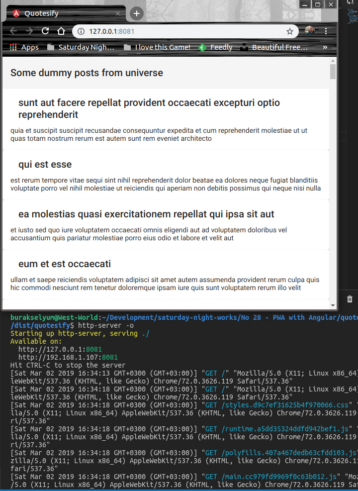
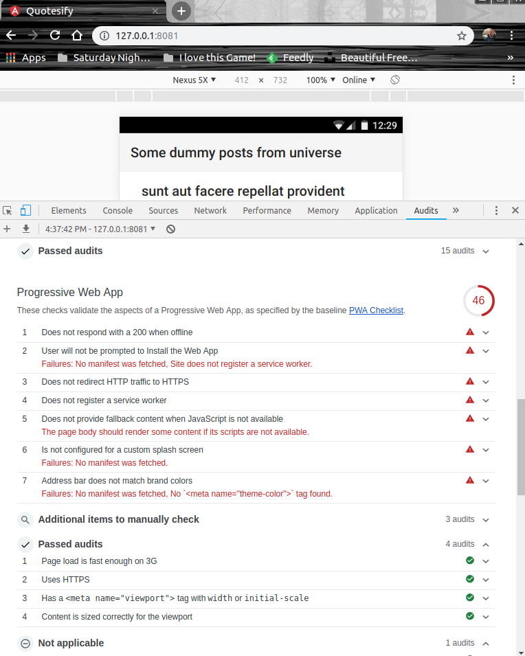
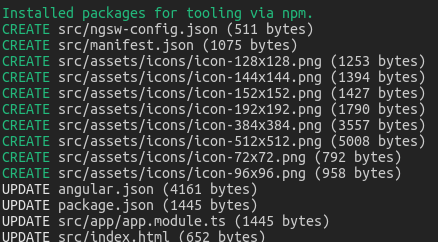
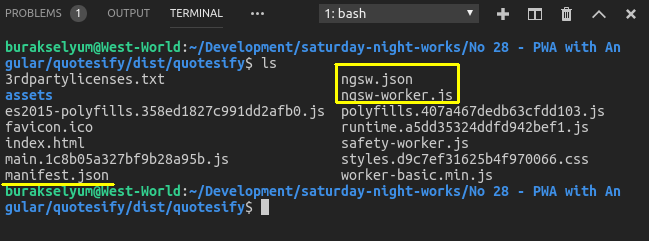
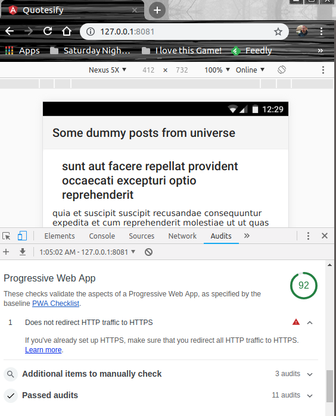

# Angular ile Bir Web Uygulamasını PWA Uyumlu Hale Getirmek

PWA tipindeki web uygulamaları özellikle mobil cihazlarda kullanılırken sanki AppStore veya PlayStore'dan indirilmiş native uygulamalarmış gibi görünürler. Ancak native uygulamalar gibi dükkandan indirilmezler ve bir web sunucusundan talep edilirler. Https desteği sunduklarından hat güvenlidir. Bağlı olan istemcilere push notification ile bildirimde bulunabilirler. Cihaz bağımsız olarak her tür form-factor'ü desteklerler. Service Worker'lar bu uygulama modelinde iş başındadır ve sürekli taze kalınmasını sağlarlar. Düşük internet bağlantılarında veya internet olmayan ortamlarda offline da çalışabilirler. URL üzerinden erişilen uygulamalar olduklarından kurulum ihtiyaçları yoktur.

Benim amacım çok yabancısı olduğum Angular ile basit bir web uygulaması yazmak ve bunu PWA uyumlu hale getirmek. 

Peki bir web sayfasından gelen içeriğin PWA uyumluluğunu nasıl test edebiliriz? Bunun için Google'ın geliştirdiği ve Chrome üzerinde bulunan Lighthouse isimli uygulama kullanılabilir. F12 ile açılan Developer Tools'tan kolayca erişilebilen Lighthouse ile o anki sayfa için uyumluluk testleri yapabiliriz. Örneğin kendi bloğum için bunu yaptığımda mobile cihazlardaki PWA uyumluluğunun %50 olarak çıktığını gördüm :/


Bakalım boş bir uygulama için bu durumu değiştirebilecek miyiz?

## Ön Hazırlıklar

Angular'ı CLI yardımıyla kurabiliriz. Angular CLI komut satırı bir çok konuda yardımcı olacaktır. Projenin oluşturulması, angular için yazılmış paketlerin kolayca eklenmesi vb... İlk komut ile CLI aracını yükledik. İkinci komutla  projeyi hazır şablonla oluşturuyoruz. UI tarafında Material Design kullanmayı öğrenmeye çalışacağım. Bu nedenle proje klasörüne girdikten sonra ng add komutu ile material'ın angular sürümünü de projeye ilave ettim _(Prebuilt tema seçimini Indigo/Pink olarak bıraktım)_

```
sudo npm install -g @angular/cli
ng new quotesify
cd quotesify
ng add @angular/material
```

## Yapılan Değişiklikler

>Değişikliklerin yapıldığı kod parçaları mümkün mertebe açıklamalarla desteklenmiş ve ne olduğu anlatılmaya çalışılmıştır.

- src/app/app.module.ts dosyasında HTTP çağrılarını yapmamızı sağlayan HttpClientModule modülünü tanımladık. Böylece HttpClient, ana modüle bağlı tüm bileşen ve servislere enjekte edilebilir _(Evet burada da Dependency Injection var. O her yerde :P )_
- Yine src/app/app.module.ts dosyasına UI tarafı kontrolleri için ilgili Material modülleri eklendi.
- _ng g service dummy_ terminal komutu ile DummyService isimli servis sınıfı eklendi. [Şuradaki](https://jsonplaceholder.typicode.com/posts) dummy servis adresinden veri çekip sunmakla görevli. Sunmak derken uygulama arayüzündeki bileşeni besleyecek.
- src/app/app.component.ts dosyasında DummyService'in kullanılması için gerekli değişiklikler yapıldı.
- src/app/app.component.html içeriği tamamen değiştirildi. Material bileşenlerine yer verildi. Toolbar tipinde bir Navigation kontrolü, Post bilgilerini göstermek içinse Card bileşeninden yararlanıldı. UI, bağlı olduğu AppComponent içerisindeki posts dizisini kullanıyor. Tüm dizi elemanlarında gezmek için *ngFor komutundan yararlanılmakta. Bir özellik değerini arayüzde göstermek içinse {{post.title}} benzeri notasyonlar kullanılıyor.

## PWA Uyumluluğu için Hazırlıklar

Amacımız uygulamanın PWA uygunluğunu kontrol etmek olduğu için öncelikle onu canlı ortam için hazırlamalıyız _(Yani Production Build gerekiyor)_ Nitekim PWA özelliklerinin bir çoğu geliştirme ortamına ilave edilmez. Build işlemi için ng CLI aracını aşağıdaki gibi kullanabiliriz.

```
ng build --prod
```


Uygulama dist klasörüne build edilmiş olur. Hizmete sunmak için http-server gibi bir araçtan yararlanılabilir. Eğer sistemde yüklü değilse npm ile kurmamız gerekebilir. İlk komutla bunu yapıyoruz. İkinci terminal komutuysa uygulamayı localhost üzerinden ayağa kaldırmak için.

```
sudo npm install -g http-server
cd dist
cd quotesify
http-server -o
```

Bunun sonucu olarak 127.0.0.1:8080 veya 8081 portundan yayın yapılır ve uygulama açılır.



Uygulama çalıştıktan sonra F12 ile Audits kısmına gidilir ve 'Run Audit' ile PWA testi başlatılırsa, Lighthouse bize aşağıdakine benzer sonuçları verir.



PWA uyumluluğu oldukça düşük çıktı. PWA uyumlu hale getirmek için neler yapılabilir bakalım.

## İhlal Edilen PWA Kriterleri

- Uygulamanın HTTPS desteği olmazsa olmazlardandır. Development tarafında sıkıntı olmasa da uygulamayı production'a aldığımızda sertifika tabanlı iletişim sağlanmalıdır.
- Service Worker olmaması sebebiyle offline çalışma ve cache kabiliyetlerinin yanı sıra push notification kabiliyletleri de ortada yoktur. Service Worker, ağ proxy'si gibi bir görev üstlenir ve uygulamanın çektiği asset'ler ile veriyi Request'lerden yakalayıp önbelleğe alma operasyonlarında işe yarar.
- Manifesto dosyasının bulunmayışı ki bu dosyada uygulama adı, kısa açıklaması, icon'lar ve diğer gerekli bilgiler yer alır. Ayrıca manifesto dosyası sayesinde add-to-home-screen ve splash screen özellikleri de etkinleşir.
- Progressive Enhancment desteğinin olmaması da bir PWA ihlalidir. Uygulamanın çağırıldığı tarayıcıya göre ileri seviye özelliklerin kullanılabileceğinin ifade edilmesi beklenmektedir.

## PWA Uyumluluğu için Yapılanlar

Angular tarafında uygulamayı PWA uyumlu hale getirmek için aşağıdaki terminal komutunu çalıştırmak yeterlidir. _(Proje klasöründe çalıştırdığımıza dikkat edelim)_

```
ng add @angular/pwa
```

Komut çalıştırıldığında eksik olan manifesto ve service worker dosyaları eklenir. Ayrıca assets altındaki icon'ların form factor desteği açısından farklı boyutları oluşur. 



Yeni bir dağıtım paketi çıktığımızda PWA için eklenen Service Worker ve manifesto dosyalarını da görebiliriz. 



Tekrardan Lighthouse raporunu çektiğimizde aşağıdaki gibi %92lik karşılama oranıyla  karşılaşırız. Fena değil ama eksik. Çünkü HTTPS desteğini göremedi.



>Peki ya kalan HTTPS ihlalini development ortamında nasıl aşabiliriz? Aşabilir miyiz? Eğer buraya kadar gelebildiysen bir adım daha ilerleyebilirsin sevgili okur ;)

## Neler Öğrendim?

- Angular CLI'ın temel komutlarını
- Bir Component'e bir servisin nasıl enjekte edilebileceğini
- Çok basit anlamda Material bileşenlerini arayüzde nasıl kullanabileceğimi
- PWA tipindeki uygulamaların genel karakteristiklerini ve avantajlarını
- PWA ihlallerinin kısaca ne anlama geldiklerini ve tespitinde Lighthouse'un nasıl kullanılabileceğini
