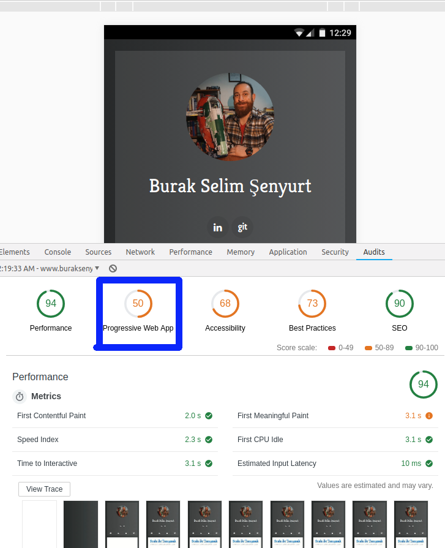

# Angular ile Bir Web Uygulamasını PWA Uyumlu Hale Getirmek

PWA tipindeki web uygulamaları özellikle mobil cihazlarda kullanılırken sanki AppStore veya PlayStore'dan indirilmiş native uygulamalarmış gibi görünürler. Ancak native uygulamalar gibi dükkandan indirilmezler ve bir web sunucusundan talep edilirler. Https desteği sunduklarından hat güvenlidir. Bağlı olan istemcilere push notification ile bildirimde bulunabilirler. Cihaz bağımsız olarak her tür form-factor'ü desteklerler. Service Worker'lar bu uygulama modelinde iş başındadır ve sürekli taze kalınmasını sağlarlar. Düşük internet bağlantılarında veya internet olmayan ortamlarda offline da çalışabilirler. URL üzerinden erişilen uygulamalar olduklarından kurulum ihtiyaçları yoktur. Benim amacım çok yabancısı olduğum Angular ile basit bir web uygulaması yazmak ve bunu PWA uyumlu hale getirmek. 

Peki bir web sayfasından gelen içeriğin PWA uyumluluğunu nasıl test edebiliriz? Bunun için Google'ın geliştirdiği ve Chrome üzerinde bulunan Lighthouse isimli uygulama kullanılır. F12 ile açılan Developer Tools'tan kolayca erişilebilen Lighthouse ile o anki sayfa için uyumluluk testleri yapabiliriz. Örneğin kendi bloğum için bunu yaptığımda mobile cihazlardaki PWA uyumluluğunun %50 olarak çıktığını gördüm.



Bakalım boş bir uygulama için bu durumu değiştirebilecek miyiz?

## Ön Hazırlıklar

Angular'ı CLI yardımıyla kurabiliriz. Angular CLI komut satırı bir çok konuda yardımcı olacaktır. Projenin oluşturulması, angular için yazılmış paketlerin kolayca eklenmesi vb... İlk komut ile CLI aracını yükledik. İkinci komutla  projeyi hazır şablonla oluşturuyoruz. UI tarafında Material Design kullanmayı öğrenmeye çalışacağım. Bu nedenle proje klasörüne girdikten sonra ng add komutu ile material'ın angular sürümünü de projeye ilave ettim _(Prebuilt tema seçimini Indigo/Pink olarak bıraktım)_

```
sudo npm install -g @angular/cli
ng new quotesify
cd quotesify
ng add @angular/material
```

## Yapılan Değişiklikler

>Değişikliklerin yapıldığı kod parçaları mümkün mertebe açıklamalarla desteklenmiş ve ne olduğu anlatılmaya çalışılmıştır.

- src/app/app.module.ts dosyasında HTTP çağrılarını yapmamızı sağlayan HttpClientModule modülünü tanımladık. Böylece HttpClient, ana modüle bağlı tüm bileşen ve servislere enjekte edilebilir _(Evet burada da Dependency Injection var. O her yerde :P )_
- _ng g service dummy_ terminal komutu ile DummyService isimli servis sınıfı eklendi. [Şuradaki](https://jsonplaceholder.typicode.com/posts) dummy servis adresinden veri çekip sunmakla görevli. 
- src/app/app.component.ts dosyasında DummyService'in kullanılması için gerekli değişiklikler yapıldı.

## Çalışma Zamanı

## Neler Öğrendim?