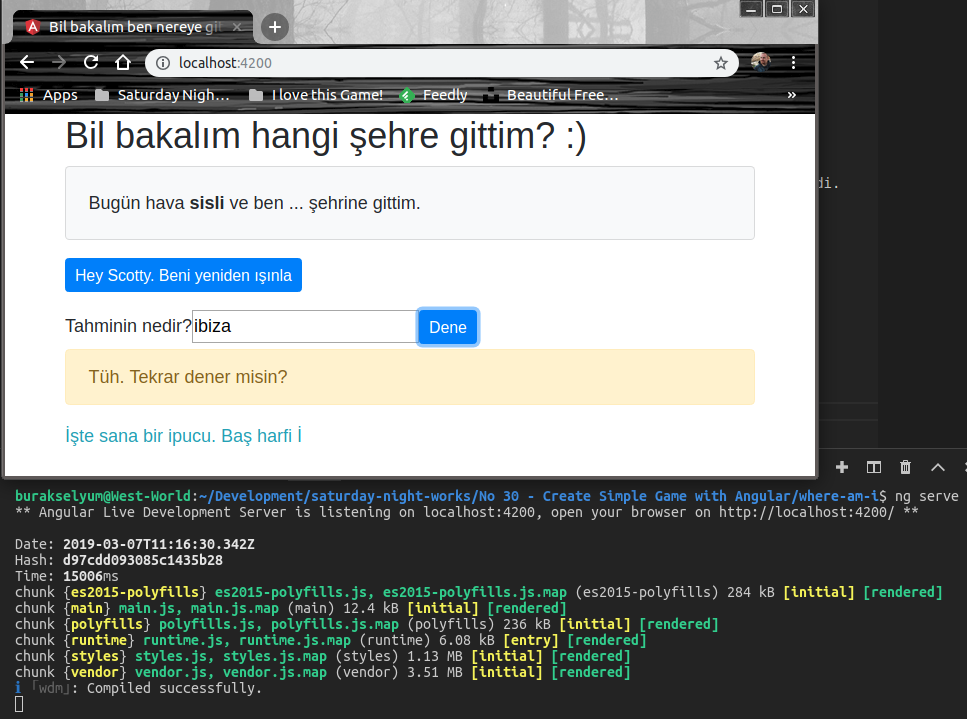

# Angular'ı Biraz Daha İyi Tanımak için Basit Bir Tahmin Oyunu Yazmak

Angular tarafını yavaş yavaş tanımaya başlıyorum. Ancak bilgilerimi pekiştirmek için farklı öğretileri uygulamaya devam etmem gerekiyor. Bu kez temelleri basit şekilde anlamak adına bir şehir tahmin oyunu yazmaya karar verdim. Uygulama havanın rastsal durumuna göre kullanıcısına bir soru soracak ve hangi şehirde olduğunu bulmasını isteyecek. Kabaca şu aşağıdaki cümleye benzer bir düşünce ile yola çıktım.

"Merhaba Burak. Bugün hava oldukça "güneşli" ve ben kendimi bir yere ışınladım. Neresi olduğunu tahmin edebilir misin?"

"güneşli" yazan kısım rastgele gelecek bir kelime. Yağmurlu olabilir, sisli olabilir vb...Buna göre uygun şehirlerden rastgele birisine gidecek bilgisayar. Biz de bunu tahmin etmeye çalışacağız. Tabii tahmini kolaylaştırmak için minik bir ipucu vereceğiz. Baş harfini söyleyeceğiz. _(ki siz bunu daha da zenginleştirebilirsiniz. Tahmin sayısını tutup belli bir oranda hak tanıyabilir, tahmin edemedikçce daha fazla harf çıkarttırabilirsiniz)_

>Örnek sonbaharını yaşamakta olan WestWorld _(Ubuntu 18.04, 64bit)_ üzerinde geliştirilmektedir.

## Ön Gereksinimler ve Kurulumlar

Sistemde angular CLI yüklü olursa iyi olur. Komut satırından angular projesi başlatmak için işimizi oldukça kolaylaştıracaktır. Sonrasında boilerplate etkisi ile uygulamayı oluşturabiliriz. Arayüzün şık görünmesini sağlamak için _(ben ne kadar şıklaştırabilirsem artık :D )_ bootstrap'i de yüklüyoruz.

```
sudo npm install -g @angular/cli
ng new where-am-i --inlineTemplate
cd where-am-i
npm install bootstrap --save
```

## Yapılan Değişiklikler

HTML ve Typescript dosyalarında yapılan ufak değişikliklerimiz var sadece.

- Bootstrap'i kullanabilmek için proje klasöründeki angular.json dosyasındaki styles elementine ilave bildirim yapıldı.
- src/app klasöründeki app.component.html dosyası değiştirildi.
- src/app klasöründeki app.component.ts typescript dosyasındaki bileşen sınıfı değiştirildi.

## Çalışma Zamanı

Uygulamayı çalıştırmak için terminalden aşağıdaki komutu vermek yeterlidir.

```
ng serve
```

Çalışma zamanına ait örnek ekran görüntülerimiz ise aşağıdakine benzer olmalıdır. Mesela bir tahmin yaptık ve sonucu bulamadıysak şuna benzer bir sonuçla karşılaşırız.



Ama sonucu bilirsek de şöyle bir ekranla karşılaşırız.


## Neler Öğrendim

- Component bileşeni ile HTML arayüzünü, sınıf özellikleri üzerinden nasıl konuşturabileceğimi
- Bootstrap temel elementlerini Angular bileşenlerinde nasıl kullanabileceğimi
- ng serve komutu ile uygulamayı çalıştırdıktan sonra, bileşen ve arayüzde yapılan değişikliklerin, save sonrası uygulamayı tekrardan çalıştırmaya gerek kalmadan çalışma zamanına yansıtıldığını
- Component arayüzünden, Typescript tarafındaki metodların bir olaya bağlı olarak nasıl tetiklenebilecekerini