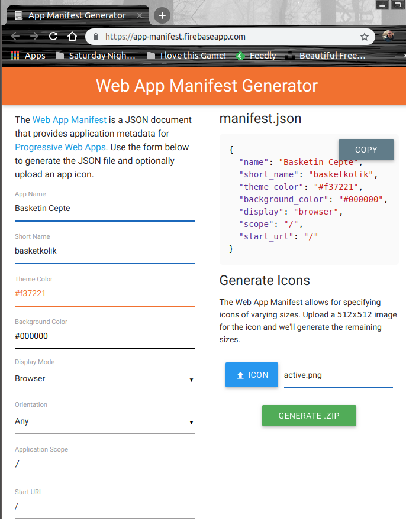
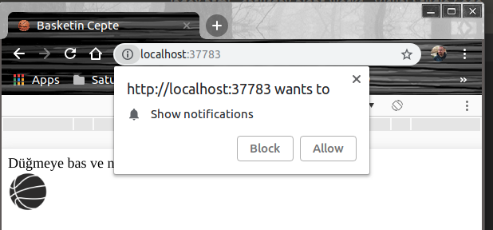
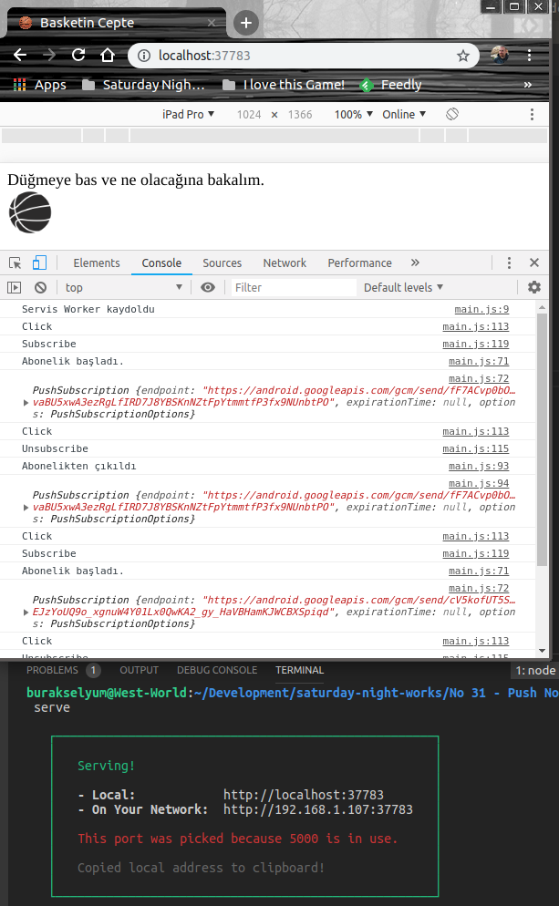
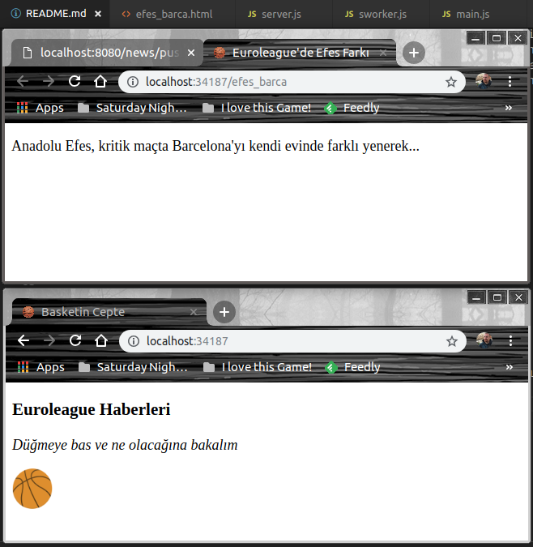
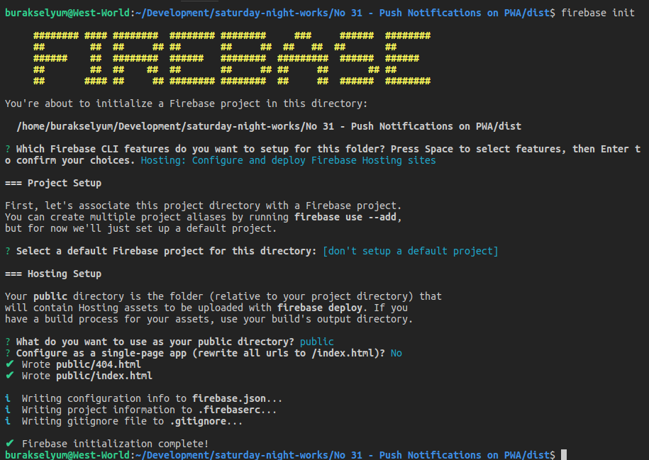
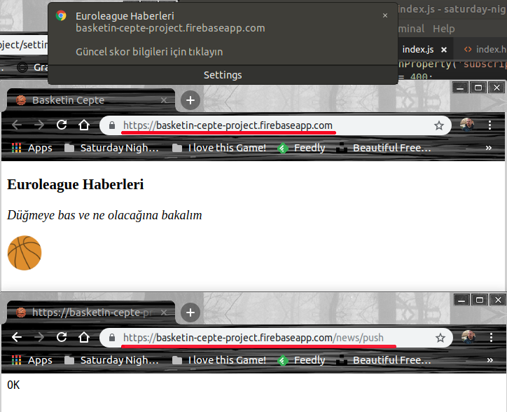

# Bir PWA uygulamasına Firebase Cloud Messaging yardımıyla bilgilendirmede bulunmak

Tarayıcı üzerinde yaşayan ve Offline veya çok düşük internet hızlarında da çalışabilme özelliğine sahip olan PWA _(Progressive Web Applications)_ uygulamalarının en önemli kabiliyetlerinden birisi de Push Notification'dır. Bu, mobil platformlardan yapılan erişimler düşünüldüğünde oldukça önemli bir nimet. Arka planda içerik güncelleme _(updating)_ özelliği de bir diğer önemli kabiliyet. Bu yetenekler uygulama için tekrardan submit operasyonuna gerek kalmadan güncel kalabilmek anlamına da geliyor.

Bu çalışmadaki amacım Google'ın Firebase Cloud Messaging alt yapısını kullanarak Push Notification özelliğinin nasıl kullanılabileceğini öğrenmek. Örneği her zaman olduğu gibi WestWorld _(Ubuntu 18.04, 64bit)_ üzerinde geliştiriyorum.

>Firebase'i Google'ın BAAS _(Back-end As A Service)_ platformu olarak düşünebiliriz.

## Ön Hazırlıklar

Başlangıç için klasör yapımızı aşağıdaki terminal komutları ile oluşturabiliriz.

```
mkdir basketkolik
cd basketkolik
touch index.html
touch sworker.js
touch main.js
touch efes_barca.html
```

Ayrıca uygulamanın testlerini HTTP üzerinden yapabilmek için serve isimli npm paketinden yararlanacağız. İlk kez kullandığım bir paket. Kurulumu için aşağıdaki terminal komutunu kullanmak yeterlidir.

```
sudo npm install -g serve
```

### Manifesto Dosyasının Oluşturulması

Manifesto dosyası PWA'nın Firebase tarafında etkinleştirilecek Push Notification özelliği için kritik. İçerisinde Sender ID değerini barındıracak _(ilerde karşınıza çıkacak)_ Önyüzün kullandığı main.js, abonelik başlatılırken bunu karşı tarafa iletmek durumunda. Peki nasıl?

Öncelikle [Firebase](https://app-manifest.firebaseapp.com/) adresine gidilir ve PWA için metadata bilgilerini tutacak bir Web App Manifest dosyası üretilir. Ben aşağıdaki bilgileri kullandım.



Sonrasında Zip dosyasını downalod edip proje klasörüne açmamız gerekiyor. Manifest.json dosyası ile birlikte images isimli bir klasör de gelecektir. Images klasöründe eklediğimiz active.png dosyasının farklı cihazlar için standartlaştırılmış boyutları yer alır. Bu bilgiler manifest.json dosyasına da konmuştur.

### Push Notification Özelliğini Etkinleştirmek

Uygulama için _Push Notification_ özelliğini etkinleştirmemiz gerekiyor. Bunun için [Firebase Console](https://console.firebase.google.com/) arabirimine gidip öncelikle yeni bir proje oluşturmalı ve ardından proje ayarlarına _(Project Overview -> Project Settings)_ ulaşarak 'Cloud Messaging' sekmesine geçilmesi lazım _(Ben 'basketin-cepte-project' isimli bir proje oluşturdum :P Hayaller başka tabii ama eldeki malzeme şimdilik  bu)_

Bu bölümde proje için oluşturulan Server Key ve Sender ID değerleri yer alır. Az önce bahsedildiği gibi Sender ID değerinin manifest.json dosyasına eklenmesi gerekmekte. gcm_sender_id yazan kısma bakınız.

Bu aşamaya gelindiğinde index.html ve main.js içerikleri de yazılmış haldedir. O yüzden kısa bir test ile push notification hizmetinin çalışıp çalışmadığı kontrol edilebilir. 

```
serve
```

Aşağıdaki ekran görüntülerindekine benzer sonuçlar elde edebiliyorsak devam edebiliriz. _(ilerleyen safhada index.html içeriği biraz daha şekerleştirilmiştir)_





>Uygulama _Push Notification_ hizmeti için abone olurken benzersiz bir ID alır. Bu ID değerini _Firebase Cloud Messaging_ sistemi kullanır ve kime bildirim yapacağını bilir.

### Abone IDlerini Tutan REST API'nin Yazılması

Abone olan uygulamaların ID bilgilerini yönetmek için Node.js tabanlı bir REST servisi yazabiliriz. Bu servisi ayrı bir klasörde projelendirmek iyi olur. Pek tabii node.js tarafında REST Servisi yazımını kolaylaştırmak için bazı paketlerden destek alabiliriz. express dışında HTTP mesajlarındaki gövdeleri kolay kullanabilmek için body-parser ve servisin Firebase Cloud Messaging ile konuşabilmesini sağlamak amacıyla da fcm-node paketi kullanılmaktadır. morgan'ı ise sunucu tarafındaki HTTP trafiğini loglamak için değerlendirebiliriz.

Servis temel olarak PWA'nın FCM ile olan iletişiminde devreye girmektedir. Hem abonelik yönetimi hem de istemcilere bildirim yapılması ki bunu tek başına yapmayacaktır. Service Worker dolaylı olarak FCM üzerinden bu servisle yakın ilişki içerisindedir.

```
mkdir PusherAPI
cd PusherAPI
touch server.js
sudo npm install express body-parser fcm-node morgan
```

## Çalışma Zamanı _(Development Ortamı)_

Uygulamanın çalışma dinamiklerini anlamak oldukça önemli. index.html olarak düşündüğümüz web uygulamamız çalıştırıldığında iki aksiyonumuz var. Basketbol topuna basıp bir abonelik başlatmak veya tekrar basarak aboneliği durdurmak.

Abonelik başlatıldığında FCM bir abonelik ID üretir ve bunu PusherAPI servisi kendisine gelen çağrı ile kayıt altına alır _(diziye eklediğimiz yer)_ Sonraki t zamanlarından birisinde PusherAPI servisinin abonelere bildirim gönderen HTTP metodu tetiklenirse, Firebase Cloud Messaging devreye girer ve dizideki ID bilgilerini kullanarak abonelere bildirim yollar. Bildirimler web uygulaması tarafındaki Service Worker _(sworker.js)_ tarafından push olayıyla yakalanır. Push olayı şimdilik sadece statik bir sayfa gösterimi yapmakta ki aslında asıl içeriği yine servis üstünden veya web'den başka bir adresten aldırabiliriz.

Testler için PWA ve servis tarafını ayrı ayrı çalıştırmalıyız.

```
serve
```

terminal komutu ile web uygulamasını,

```
node server.js
```

ile de REST Api servisini.

Aboneliği başlattıktan sonra http://localhost:8080/news/push adresine talepte bulunursak bir bildirim mesajı ile karşılaşırız _(sworker daki push event'i tetiklenir)_ Aynen aşağıdaki ekran görüntüsünde olduğu gibi.


Bildirim kutusunda tıklarsak statik olarak belirlediğimiz sayfa açılacaktır _(notificationclick olayı tetiklenir)_



## PWA ve Service Uygulamalarının Firebase Hosting'e Alınması

Her iki uygulamada local development ortamında gayet güzel çalışıyor gibi. Ancak bunu anlamlı hale getirmek için her iki ürünü de Firebase üzerine dağıtıp barındırmamız gerekiyor. Web uygulamasını Firebase Hosting ile REST servisini de Firebase Function ile yayınlamalıyız. Bu işlemler için firebase-tools aracına ihtiyacımız olacak. Terminalden aşağıdaki komutu kullanarak yükleyebiliriz.

```
sudo npm install -g firebase-tools
```

### Basketkolik'in Dağıtımı

Yeni bir dağıtım klasörü oluşturmalı, initializion işlemini gerçekleştirip basketkolik uygulama kodlarını oluşan public klasörü içerisine atmalıyız. Ardından üzerinde çalışacağımız projeyi seçip deploy işlemini yapabiliriz.

```
mkdir dist
cd dist
firebase init
cp -a ../basketkolik/. ./public/
firebase use --add basketin-cepte-project
firebase deploy
```

firebase init işleminde aşağıdaki görüntüde yer alan seçimlerle ilerleyebiliriz.



deploy işlemi başarılı olursa aşağıdaki ekran görüntüsündekine benzer sonuçlar elde edilir.


### PusherAPI servisinin Dağıtımı

Hatırlanacağı üzere web uygulaması bir REST Servisi yardımıyla FCM sistemini kullanıyordu. PusherAPI isimli uygulama, Fireabase tarafı için bir Function anlamına gelmektedir _( 'Serverless App' olarak düşünelim)_ Ölçeklenebilirliği, HTTPS güvenliği, otomatik olarak ayağa kalkması gibi bir çok iş Google Cloud ortamınca halledilir. Şimdi aşağıdaki terminal komutu ile fonksiyon klasörünü oluşturalım _(dist klasörü içerisinde çalıştığımıza dikkat edelim)_

```
firebase init functions
```

Sorulara şöyle cevaplar verebiliriz;

- Dil olarak Javascript seçelim.
- ESLint kullanımına Yes.
- npm dependency'lerin kurulmasına Yes.

Devam eden adımda functions klasöründeki index.js dosyasının içeriğini PusherAPI'deki server.js ile değiştirmeliyiz. Ancak bu kez express'in firebase-functions ile kullanılması gerekiyor. İhtiyacımız olan express, body-parser ve fcm-node paketlerini üzerinde çalıştığımız functions klasörü içinde de yüklemeliyiz. Son olarak dist klasöründeki firebase.json'a rewrites bölümünü ekleyip fonksiyonumuzu deploy edebiliriz.

```
cd functions
sudo npm install express body-parser fcm-node
firebase deploy
```

Şimdi web uygulamasının kullandığı main.js içeriğini, eklediğimiz google functions'a uyumlu hale getirmemiz gerekiyor. Tahmin edileceği üzere gidilen servis adreslerini oluşturulan firebase proje adresleri ile değiştirmeliyiz _(dist/public/main.js içeriğini kontrol edin)_

Web uygulamasındaki bu değişikliği Cloud ortamına taşımak içinse public klasöründe yeniden deploy işlemi yapmalıyız.

```
firebase deploy
```

## Çalışma Zamanı _(Production Ortamı)_

Uygulama artık https://basketin-cepte-project.firebaseapp.com/ adresinden yayında olacaktır.




## Neler Öğrendim

- Firebase Cloud Messaging _(FCM)_ sisteminin kabaca ne işe yaradığını
- PWA uygulamasının FCM ile nasıl haberleşebileceğini
- Abone olan istemciye bildirimlerin nasıl gönderilebileceğini
- Service Worker üzerindeki push ve notificationclick olaylarının ne anlama geldiğini
- serve paketinin kullanımını
- firebase terminal aracı ile deployment işlemlerinin nasıl yapıldığını
- Web uygulaması ve Functions'ın Google Cloud tarafından bakıldığında farklılıklarını

>Proje bir süre sonra Google platformundan kaldırılmış olabilir. O nedenle kendiniz başarmaya çalışırsanız daha kıymetli olacaktır.