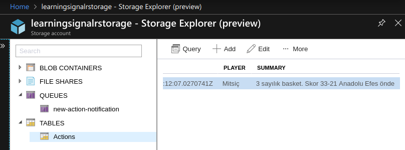

# Azure SignalR Servisini Kullanmak

Amacım Azure platformundan sunulan SignalR hizmetini kullanarak abone olmuş istemcilere bildirimde bulunabilmek. Normal SignalR senaryosundan farklı olarak, istemciler ve tetikleyici arasındaki eş zamanlı iletişimi _(Real Time Communications)_ Azure platformundaki bir SignalR servisi ile gerçekleştirmeye çalışacağım. Senaryomuzda bildirimleri gören web tabanlı bir istemci, local ortamda çalışan ve bildirim yayan bir Azure Function ve Azure platformunda konuşlandırılan bir SignalR servisi bulunuyor. Azure üzerinde koşan SignalR servisi Serverless modda çalışacak şekilde ayarlanacak. 

SignalR servisi tüm Azure fonskiyonları ile kullanılabilir. Örneğin Azure Cosmos DB'deki değişiklikleri SignalR servisi ile istemcilere bildirebiliriz, benzer şeyi kuyruk mesajlarını veya HTTP taleplerini işleyen Azure Fonksiyonları için de sağlayabiliriz. Kısacası Azure fonksiyonlarından yapılan tetiklemeler ile SignalR abonelerini bilgilendirebiliriz.

## Ön Gereksinimler

Azure platformunda SignalR servisini oluşturmadan önce WestWorld _(Ubuntu 18.04, 64bit)_ tarafında Azure Function geliştirebilmek için gerekli kurulumları yapmam gerekiyor. İlk olarak Azure Functions Core Tools'un yüklenmesi lazım. Aşağıdaki terminal komutları ile bunu gerçekleştirdim. Önce Microsoft ürün anahtarını kayıt ettik, sonrasında bir güncelleme yapıp nihayetinde azure-functions-core-tools paketini yüklettik.

```
curl https://packages.microsoft.com/keys/microsoft.asc | gpg --dearmor > microsoft.gpg
sudo mv microsoft.gpg /etc/apt/trusted.gpg.d/microsoft.gpg

sudo apt-get update

sudo apt-get install azure-functions-core-tools
```

Kurulumdan sonra terminalden Azure Function projeleri oluşturmaya başlayabiliriz. Lakin bu işin Visual Studio Code tarafında daha kolay bir yolu var. Azure Functions isimli extension'ı kullanmak.


Sonrasında Visual Studio Code'a gelen yeni araçla kolayca Azure Function projeleri oluşturabiliriz. 

## Azure SignalR Servisinin Hazırlanması

Ama öncesinde Azure'da bir SignalR servisi oluşturmam gerekiyor. [Azure Portal](https://portal.azure.com) adresinden SignalR Service öğesini aratarak işe başladım.


Free Tier planında, learning-rg Resource Group altında basketcini.service.signalr.net isimli bir SignalR servisi oluşturdum. SignalR servisinin oluşması biraz zaman aldı. Servis etkinleştikten sonra ise özelliklerine giderek Serverless modda çalışacak şekilde ayarladım.


Oluşan SignalR servisi ile local makinede çalışacak ve tetikleyici görevini üstlenecek Azure Functions'ın haberleşebilmesi için, Key değerlerine de ihtiyacım olacak. Bu değerleri Azure Function uygulamasının local.settings.json dosyasında kullanacağız.


## Azure Functions Projesinin Oluşturulması

Yüklenen Azure Functions aracından 'Create New Project' seçimini yaptım. Proje için bir klasör belirledim _(Ben NotifierApp isimli klasörü kullandım)_ Dil olarak C#'ı tercih ettim. Sonrasında 'Create Function' seçeneği ile projeye Scorer isimli bir fonksiyon ekledim. Bu ekleme işlemi sırasında sorulan sorulara aşağıdaki cevapları vererek ilerledim. HTTP metodları ile tetiklenen bir fonksiyon söz konusu. 

```
Fonksiyon Adı   :       Scorer
Klasör          :       NotifierApp
Tipi            :       Http Trigger
Namespace       :       Basketcini.Function
Erişim Yetkisi  :       Anonymous
```

>Örnekte Table Storage kullanılmıştır. Ben Azure Portal üzerinde learningsignalrstorage isimli bir Storage Account oluşturdum ve 'Access Keys' kısmında verilen Connection Strings bilgisini kullandım. Yani bildirimlerin depolanacağı Storage alanını Azure'a devrettim.

### Azure Functions Projesinde Yapılanlar

Kod tarafında kullanılan bazı tipler için ek paketlerin yüklenmesi gerekiyor.

```
dotnet add package Microsoft.Azure.WebJobs.Extensions.EventGrid 
dotnet add package Microsoft.Azure.WebJobs.Extensions.SignalRService 
dotnet add package Microsoft.Azure.WebJobs.Extensions.Storage
```

- local.settings.json dosyasına Azure SignalR servisine ait Connection String bilgisi ve CORS tanımlamaları _(Web uygulaması ile servis arasındaki iletişime izin verebilmek için)_ eklendi
- Skor durumunu ve anlık olarak meydana gelen olayı tutan sınıflar eklendi _(Timeline ve Action)_
- Scorer isimli Function sınıfına 3 metod eklendi. Birisi tetikleyici olarak yeni bir olay gerçekleştirmek için, birisi istemcinin kendisini SignalR Hub'ına bağlaması için, birisi de servisin istemciye olay bildirimlerini basması için.

## İstemci Uygulama Tarafı

>throw NotImplementedException();

## Çalışma Zamanı _(NotifierApp Uygulaması)_

Öncelikle senaryodan bahsetmem lazım. WestWorld üzerinde NotifierApp isimli Azure Function uygulaması ayağa kaldırılır. Bu Azure SignalR servisi ile haberleşen uygulamamızdır. Postman ile oynanan basketbol maçındaki anlık olaya ait bilgiler gönderilir. Bu bilgiler SignalR servisi tarafından karşılanır, Table Storage'e ve kuyruğa yazılır. Yine WestWorld üzerinde çalışan bir Web uygulaması _(basit bir HTML sayfası olarak düşünelim. Lakin HTTP Post gönderme kabiliyetlerine sahip olsun)_ local ortamda çalışan Azure Function servisine bağlanır ve 'actionHappend' olaylarını dinlemeye başlar. Postman üzerinden yeni bir basketbol olayı paylaştıkça bu bilgilerin tamamının yer aldığı kuyruk içeriği abone olan istemcilere otomatik olarak basılır. Sonuçta canlı bir maç oynanırken gerçekleşen anlık olayların, bu haber kanalını dinleyen web istemcilerine eş zamanlı olarak basılması sağlanır _(en azından senaryonun bu şekilde çalışmasını bekliyorum)_

Yazılan Azure Function uygulamasını çalıştırmak için terminalden aşağıdaki komutu vermek yeterlidir. Tabii bu komutu Azure Function projesinin olduğu klasörde çalıştırmalıyız ;)

```
func host start
```


Function local ortamda çalışır durumda ve Azure SignalR ile haberleşmesini bekliyorum. Bunu üzerine Postman'i kullanarak api/Scorer adresine bir HTTP Post talebi göndermeye çalıştım.

```
Url     :   http://localhost:4503/api/Scorer
Method  :   HTTP Post
Body    :   {
	"Who":"Mitsiç",
	"WhatHappend":"3 sayılık basket. Skor 33-21 Anadolu Efes önde"
}
```


Bir şeyleri doğru yazmış olmalıyım ki loglarda istediğim hareketliliği gördüm. Hatta Azure Storage tarafında bir tablonun oluşturulduğunu ve gönderdiğim bilginin içerisine yazıldığını da fark ettim.



## Çalışma Zamanı _(Web İstemcisi)_

>throw NotImplementedException();

## Neler Öğrendim

>throw NotImplementedException();