# Sunucu Bazlı Blazor Uygulaması ve Firestore Kullanımı

Blazor client-side web framework olarak düşünülebilir _(Component ve DOM etkileşiminin aynı process içerisinde gerçekleşmesi)_ ancak process'lerin ayrılması konusunda da esnektir. Öyle ki, Blazor'u bir Web Worker içinde çalıştırıp UI thread'inden ayrıştırılabileceği ifade edilmektedir. Diğer yandan 0.5 sürümü ile birlikte Blazor uygulamalarının sunucu tarafında çalıştırılması mümkün hale gelmiştir. Yani .Net Core ile etkileşimde olacak şekilde Blazor bileşenlerini _(component)_ sunucu tarafında çalıştırabiliriz. Burada .Net tarafı WebAssembly yerine CoreCLR üzerinde koşar ve .NET ekosisteminin tüm nimetlerinden _(JIT, debugging vb)_ yararlanabilir. UI tarafı ile etkileşimde olayların ele alınması ve Javascript Interop çağrıları için SignalR bağlantılarından yararlanılır.

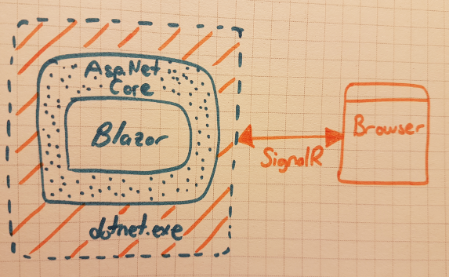

Benim amacım Server Side tipinden bir Blazor uygulamasının Ubuntu gibi bir platformda nasıl geliştirilebileceğini öğrenmek ve bunu yaparken de Google Cloud Firestore'u kullanarak basit CRUD operasyonları içeren bir ürün tasarlamak.

## Ufak Tefek Notlar

Server Side Blazor'un belli avantajları da var tabi.

- Uygulama download boyutu nispeten küçülür
- Blazor bileşenleri _(component)_ .Net Core uyumlu sunucu kabiliyetlerinin tamamını kullanabilir
- Debugging ve JIT Compilation imkanları sağlanır
- Server-Side Blazor tarafı Mono WebAssembly yerine .Net Core process'i içinde çalışır ve WebAssembly desteği olmayan tarayıcılar için de bir açık kapı bırakır
- UI tarafının güncellemeleri SignalR ile gerçekleşir ve gereksiz sayfa yenilemeleri olmaz
- _(Eksi puan)_ UI etkileşimi için SignalR kullanılması ağ üzerinde ekstra hareket anlamına gelir.

## Ön Gereksinimler

Visual Studio Code'un olduğu WestWorld'de _(Ubuntu 18.04,64bit)_ Visual Studio 2017/2019 nimetleri olmasa da Server Side Blazor uygulamaları geliştirebiliriz. Bunun için terminalden aşağıdaki komutu vermek yeterlidir.

```
sudo dotnet new --install "Microsoft.AspNetCore.Blazor.Templates"
dotnet new --help
```

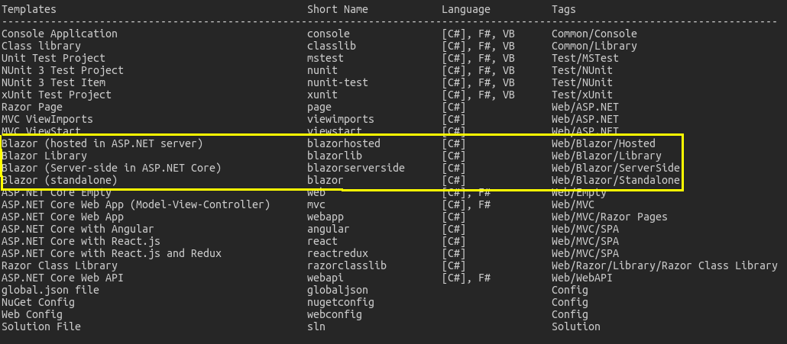

Görüldüğü gibi 'new' şablonlarına Blazor eklentileri geldi.

## Cloud Firestore Tarafının Hazırlanması

Öncelikle [Firebase Console'a](https://console.firebase.google.com/) gidilir ve yeni bir proje oluşturulur. Ben aşağıdaki özelliklere sahip enbiey _(NBA)_ isimli bir proje oluşturdum.

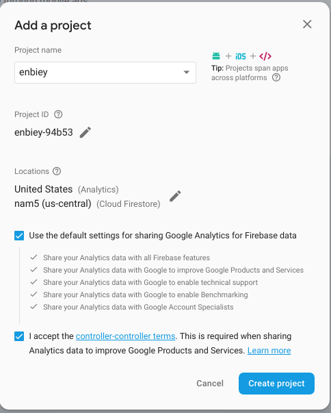

Ardından database sekmesinden 'Create Database' seçeneğini kullanarak ilerledim. Security rules penceresinde 'Start in locked mode' seçeneğini işaretli bıraktım.

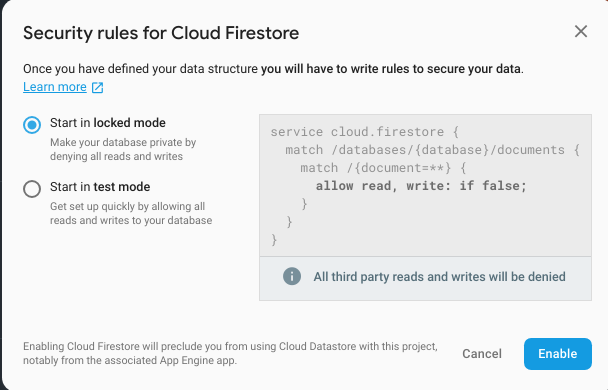

Varsayılan olarak 'Cloud Firestore' tipinden bir veri tabanı oluşturulur _(Realtime Database tipinide kullanabilirdik)_

Sonrasında bir koleksiyon _(collection)_ ve örnek bir doküman _(document)_ ile ilk veri girişimi yaptım.

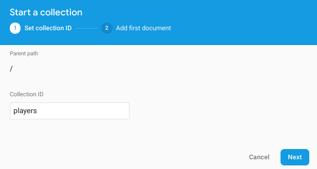

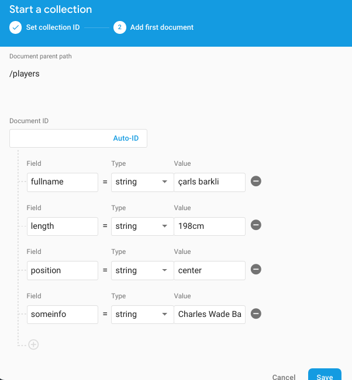

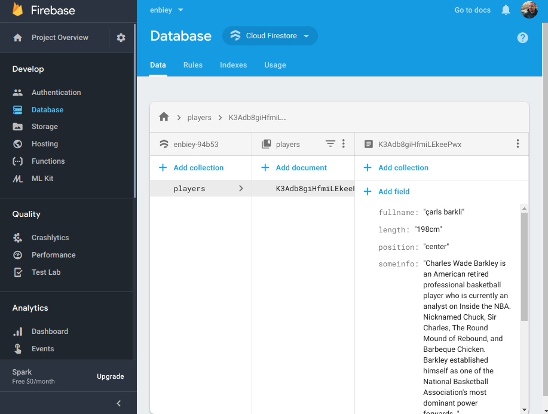

Yazılacak Blazor uygulamasının _(başka uygulamalar içinde benzer durum söz konusu aslında)_ Firestore veri tabanını kullanabilmesi için Credential ayarlamalarının da yapılması gerekiyor. Yeni açılan projenin Service Account'u için bir key üretmemiz lazım. Öncelikle [Google IAM adresine]( https://console.cloud.google.com/iam-admin/) gidip projeyi seçtim ve ardından istediğim service account'u işaretleyip üç nokta düğmesini kullanarak Create Key dedim.


Gelen penceredeki varsayılan JSON seçimini olduğu gibi bıraktım.

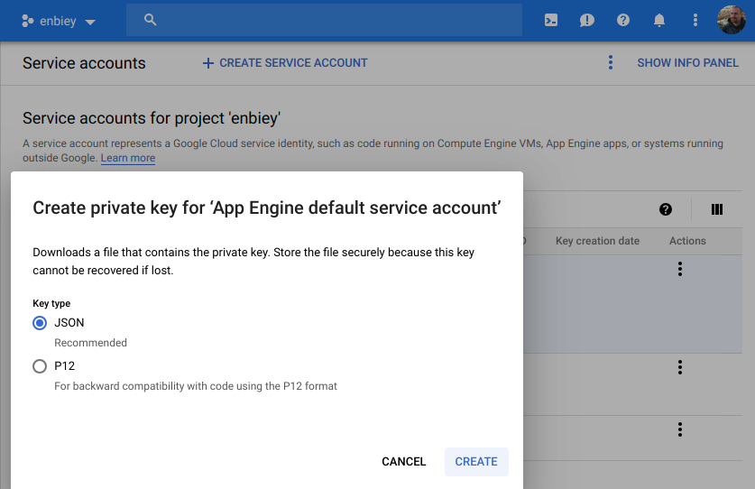

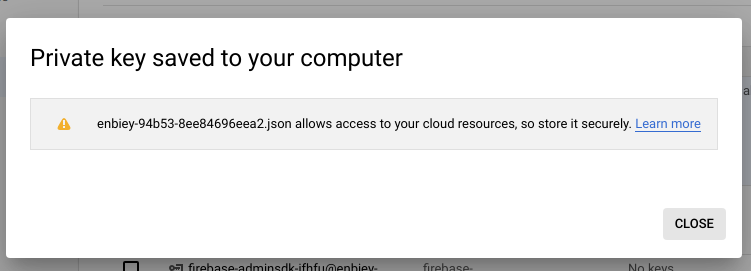

İndirilen json uzantılı dosya içeriği Blazor uygulaması için gerekli olacak.

## Server Side Blazor Uygulamasının İnşası

Terminalden aşağıdaki komutu vererek Hosted in ASP.NET server tipindeki blazor çözümünü inşa ettim.

```
dotnet new blazorhosted -o NBAWorld
```

Üç adet proje oluşturulacaktır. Shared kütüphanesi, Client ve Server projeleri tarafından ortaklaşa kullanılır. Client projesi Server tarafına da referans edilmiştir _(csproj dosyalarını kontrol ediniz)_ Client projesi tarayıcıda gösterilecek bileşenleri içerir. Firestore'a erişeceğimiz API Controller tarafı Server projesinde bulunur. Model sınıfları gibi paylaşılacak tiplerse Shared projesinde yer alacaklardır.

Shared ve Server projeleri Google Cloud Firestore ile çalışacaklar. Bu nedenle her iki projeye de 'Google.Cloud.Firestore' paketini eklememiz gerekiyor.

```
dotnet add package Google.Cloud.Firestore --version 1.0.0-beta19
```

>Örneği çalıştığım tarihte bu paket sürümü mevcuttu. Siz denerken güncel paket sürümüne bir bakın.

## Solution Kodlarında Yapılan Değişiklikler

### NBAWorld.Shared Projesi

- Models isimli bir klasör açıldı ve içerisine Player isimli Entity sınıf eklendi.

### NBAWorld.Server Projesi

- Data isimli bir klasör açıldı ve players koleksiyonu için Data Access Layer görevini üstlenecek PlayerDAL sınıfı eklendi.
- Controller klasörüne API Controller görevini üstlenen PlayersController sınıfı eklendi.

### NBAWorld.Client Projesi

- Pages klasöründeki Counter ve Fetch Data Razor sayfaları silindi.
- Pages klasörüne PlayerData.cshtml isimli Razor Page ile PlayerData.cshtml.cs kod dosyaları eklendi. _(Tüm oyuncu listesini gösteren bileşen)_
- index.cshtml düzenlendi
- Pages klasörüne NewPlayer.cshtml sayfası ve NewPlayer.cshtml.cs bileşeni eklendi. _(Yeni oyuncu ekleme işini üstlenen bileşen)_
- NavMenu.cshtml dosyasına yeni razor sayfaları için linkler eklendi ve diğer parçalar kaldırıldı.

>throw new ToBeContinuedException("Delete, Update operasyonları eklenmeli.");

## Çalışma Zamanı

Uygulamayı WestWorld'de yazmaya çalıştığım için Visual Studio Code ve bir Solution ile karşı karşıyayım. Visual Studio Code'da NBAWorld klasörünü ayrıca açıp F5 tuşuna bastım. Bana çözümü hangi derleyici ile debug etmek istediğim soruldu. '.Net Core' seçeneğini işaretlediğimde ilgili Debug ayarları JSON dosyasına eklendi ve Build işlemi başladı. Ardından uygulama ayağa kalkıp _(ki oraya gelene kadar aldığım hataları düzelttim)_ http://localhost:5888/ adresinden yayına başladı.

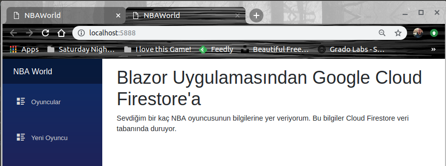


Yeni bir efsane eklemek için NewPlayer sayfasını kullanabiliriz.

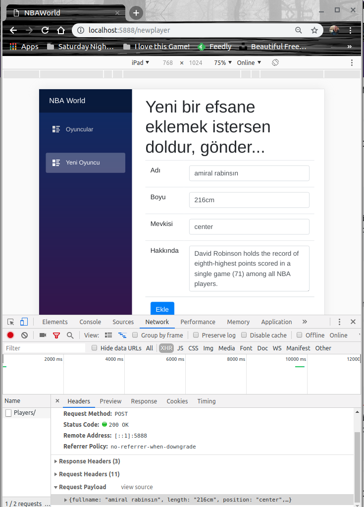

>throw new ToBeContinuedException();

## Neler Öğrendim

- Blazor proje şablonlarını Ubuntu gibi bir platformda .Net Core için nasıl kullanabileceğimi
- Google Cloud üzerinde Firestore veri tabanı oluşturmayı
- Credential dosyasının ne işe yaradığını
- Ön yüz sayfalarının bir API Controller ile nasıl haberleşebileceğini
- Basit Blazor bileşeni oluşturmayı
- Blazor bileşeni ile Razor sayfasının nasıl etkileştiğini
- FirestoreData ve FirestoreProperty niteliklerinin kullanımını
- Ortak kütüphanede model oluşturmayı
- Server Side tarafında Firestore ile haberleşen bir Data Access nesnesi yazmayı

>throw new ToBeContinuedException();