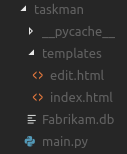
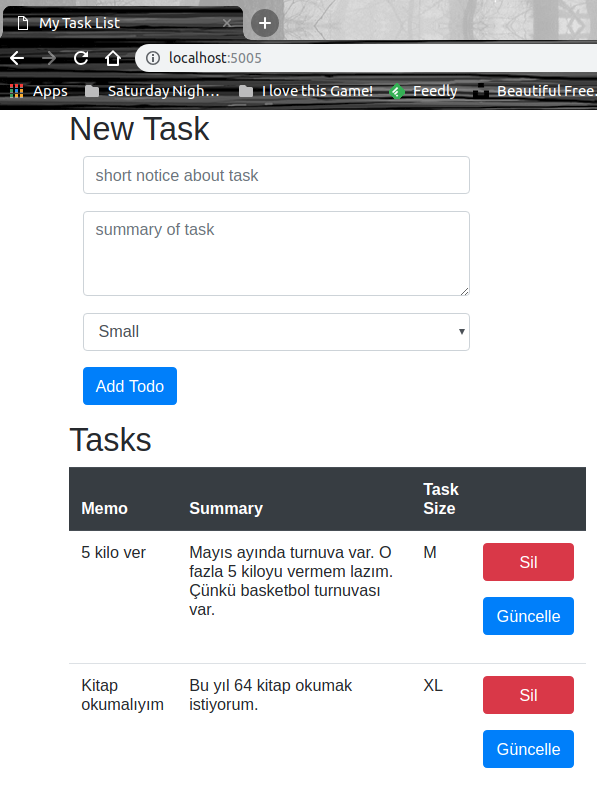
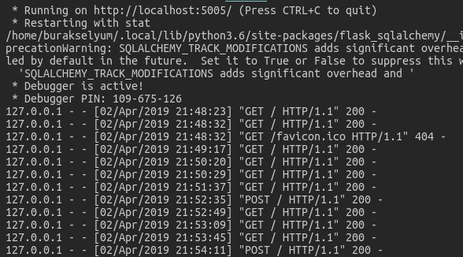

# Flask Üzerinden SQLite ile Konuşan Bir Python Uygulaması

Amacım bir parça Python kodu yazarak bilgilerimi tazelemekti. SQLite veri tabanını kullanan, CRUD operasyonlarını Flask üzerinden servis çağrıları ile gerçekleştiren _(Flask aynı zamanda web yönlendirmelerini de üstlenecek)_ basit bir Web sayfası tasarlamaya karar verdim. Python ile veri tabanı arasındaki geçişleri daha anlaşılır kılmak için SQLAlchemy, Flask ile SQLAlchemy arasındaki geçişleri basitleştirmek içinse flask-sqlalchemy modüllerini kullanmak istedim.

## Gereksinimler ve Hazırlıklar

İşe aşağıdaki terminal komutları ile başladım.

```
mkdir taskman
cd taskman
touch main.py
mkdir templates
touch templates/index.html

```

Aşağıdaki şekilde görülen iskeleti oluşturdum. 



Ana kod yüklenicimiz main.py ve web sayfası index.html şeklinde. templates klasörü otomatik olarak Flask tarafından takip ediliyor olacak. _(Koddaki yorum satırlarını okuyunuz)_

Sırada uygulama için gerekli python modüllerinin yüklenmesi var.

>WestWorld _(Ubuntu 18.04, 64bit)_ python ve pip ortamlarına sahiptir

```
pip3 install --user flask sqlalchemy flask-sqlalchemy
```

## Veri tabanının oluşturulması

Veri tabanını oluşturmak için kod dosyasını tamamladıktan sonra terminalden python3 ile gidip aşağıdaki ifadeleri çalıştırmak yeterli.

```
from main import db
db.create_all()
exit()
```

Sorun olmazsa Fabrikam.db isimli SQLite veritabanı oluşacaktır. Visual Studio Code SQLite Explorer'dan veri tabanı içeriğini görebiliriz.


## Çalışma Zamanı

Uygulamayı aşağıdaki terminal komutu ile çalıştırıp http://localhost:5005 adresi üzerinden test edebiliriz.

```
python3 main.py
```

Örnek bir kaç veri girişi yapıldığındaki durum;



ki SQLite veri tabanındaki todo tablosunun içeriği de dolmuştur.


Bu arada çalışma zamanında meydana gelen hareketlilikleri terminal pencersinden de görebiliriz.



>ToBeContinued("Update bölümü eklenmeli");

## Neler Öğrendim

- Flask ile HTTP taleplerinin nasıl karşılanacağını
- templates klasöründeki HTML içeriklerinin otomatik render edilebileceğini
- form'dan gelen değerlerin python tarafında nasıl ele alındığını
- HTML içerisinde python kodlarındaki değişkenlere nasıl erişilebileceğini
- 
- Bootstrap stillerini CDN üzerinden kullanmayı