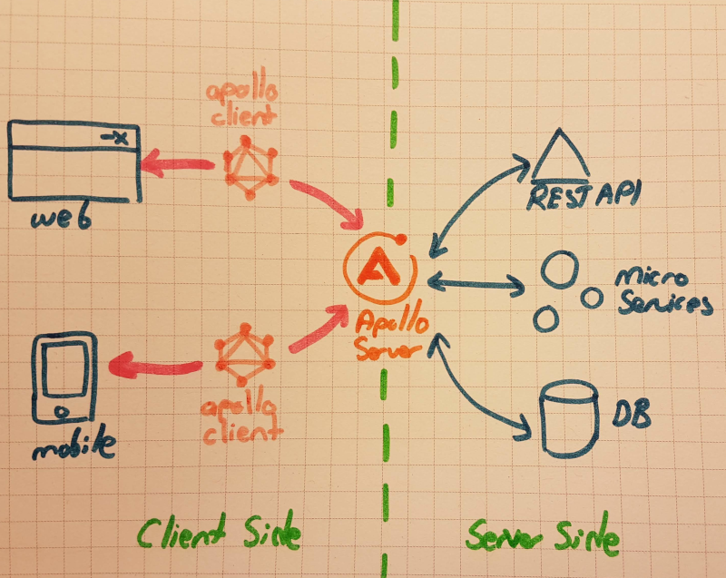
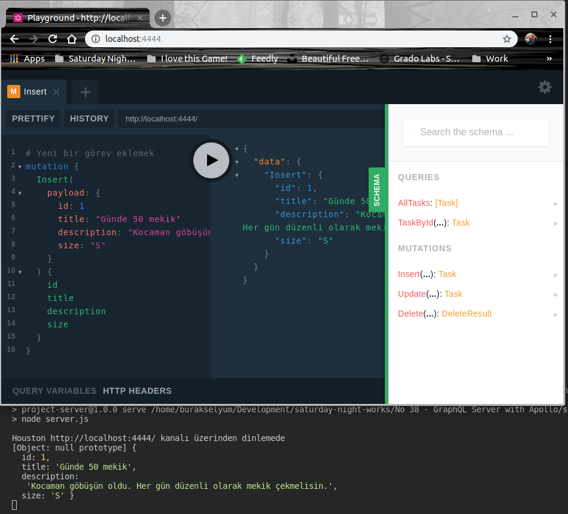
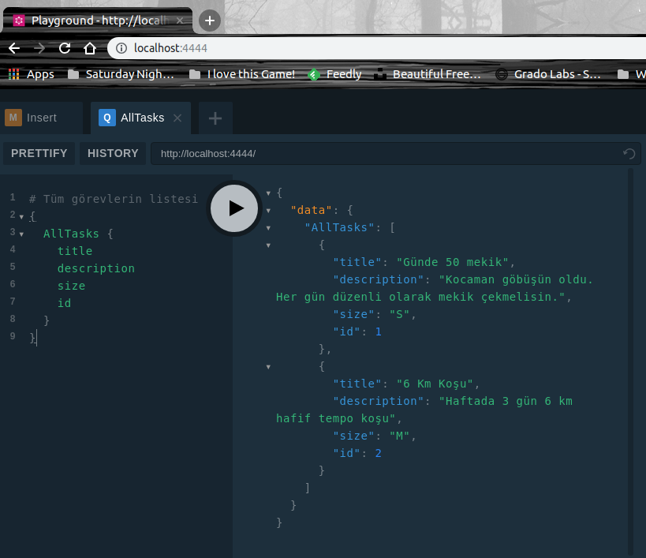
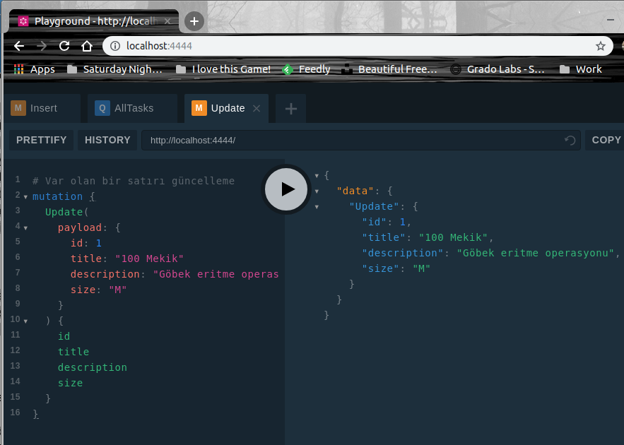
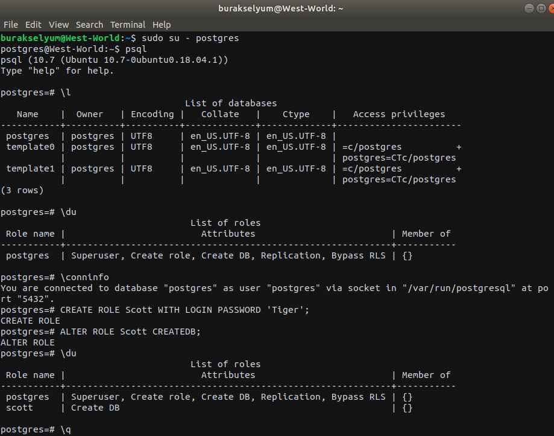
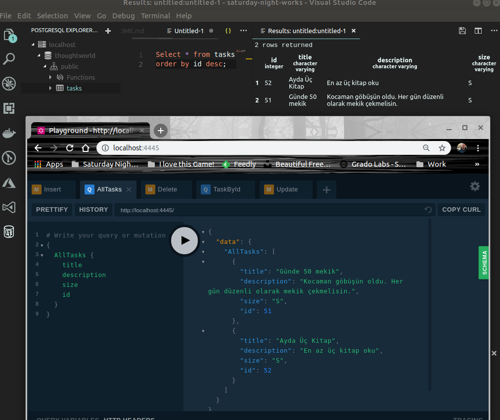

# Apollo Server ile Bir GraphQL Sunucusu Yazmak

Apollo Server, web, mobile gibi istemciler için GraphQL servisi sunan bir ürün olarak düşünülebilir. Otomatik API doküman desteği sunar ve herhangibir veri kaynağını kullanabilir. Yani bir veri tabanını veya bir mikroservisi ya da bir REST APIyi, GraphQL hizmeti verebilecek şekilde istemcilere açabilir. Tek başına sunucu gibi çalıştırılabileceğinden de ilgimi çekti aslında. Pek tabii Heroku gibi ortamlarca Serverless olarak da kullanılabiliyor. Kabaca aşağıdaki şekli göz önüne alabiliriz.



İstemciler kendilerine uygun Apollo Client paketlerini kullanarak sunucu tarafı ile kolayca haberleşebilirler. 

Benim amacım stand alone çalışan bir Apollo sunucusu yazmak ve arka tarafta bir veri tabanını kullanarak veriyi GraphQL üzerinden istemcilere açmak.

## Başlangıç ve İlk Kurulumlar

Proje iskeletini aşağıdaki gibi oluşturabilir ve Node.js tarafı için gerekli paketleri yükleyebiliriz.

>Örneği her zaman olduğu gibi WestWorld _(Ubuntu 18.04, 64bit)_ üzerinde deniyorum.

```
mkdir project-server
cd project-server
npm init
npm install apollo-server graphql
touch server.js
```

## Birinci Sürüm

İlk sürümde veriyi bir diziyle besledim. Temel amaç Apollo Server'ın meziyetlerini ortaya koymaktı. 

- server.js içeriği yazıldı _(kod dosyasındaki açıklamalardan yardım alabilirsiniz)_

Her iki sürümü çalıştırmak için terminalden 

```
npm run serve
```

yazmak yeterli. _(Tahmin edileceği üzere package.json içerisine eklediğimiz bir run komutu var)_ Bunun sonucu olarak http://localhost:4444 adresine gidebilir ve otomatik olarak açılan Playground arabirimi üzerinden denemelerimizi yapabiliriz. 

Array kullanan bu ilk sürümün çalışma zamanına ait bir kaç ekran görüntüsüyse şöyle.

```
# Yeni bir görev eklemek
mutation {
  Insert(
    payload: {
      id: 1
      title: "Günde 50 mekik"
      description: "Kocaman göbüşün oldu. Her gün düzenli olarak mekik çekmelisin."
      size: "S"
    }
  ) {
    id
    title
    description
    size
  }
}
```



```
# Tüm görevlerin listesi
{
  AllTasks {
    title
    description
    size
    id
  }
}
```



```
# Var olan bir satırı güncelleme
mutation {
  Update(
    payload: {
      id: 1
      title: "100 Mekik"
      description: "Göbek eritme operasyonu"
      size: "M"
    }
  ) {
    id
    title
    description
    size
  }
}
```



```
# Id değerine göre görev silinmesi
mutation {
  Delete(id: 1) {
    DeletedId
    Result
  }
}
```


İlk sürüm önceden de belirttiğimiz üzere Apollo Server'ı basitçe işin içerisine katmak ve nasıl çalıştığını anlamak içindi. Array içeriği kalıcı bir ortamda saklanmadığı için uygulama sonlandırıldığında tüm görev listesi kaybolacaktır. Kalıcı bir depolama alanı için farklı bir alternatif düşünmeliyiz. CRUD operasyonlarını başka bir servise atayabilir veya bir veri tabanı kullanabiliriz.

## İkinci Sürüm

İkinci sürümde amaç veri kaynağı olarak PostgreSQL kullanmak. WestWorld üzerinde PostgreSQL ile ilgili olarak aşağıdaki terminal komutlarını işlettim.

```
sudo apt-get install postgresql

sudo su - postgres
psql

\l
\du
\conninfo

CREATE ROLE Scott WITH LOGIN PASSWORD 'Tiger';
ALTER ROLE Scott CREATEDB;

\q
```

İlk komut ile postgresql'i Linux ortamına kuruyoruz. Kurma işlemi sonrası ikinci ve üçüncü komutları kullanarak varsayılan kullanıcı bilgisi ile Postgresql ortmına giriyoruz. \l ile var olan veri tabanlarının listesini, \du ile kullanıcıları _(rolleri ile birlikte)_ , \conninfo ile de hangi veri tabanına hangi kullanıcı ile hangi porttan bağlandığımıza dair bilgileri elde ediyoruz. CREATE ROLE ile başlayan satırda Scott isimli yeni bir rol tanımladık. Sonrasında takip eden komutla bu role veri tabanı oluşturma yetkisi verdik. \q ile o an aktif olan oturumu kapatıyoruz. Şimdi scott rolünü kullanarak örnek veri tabanımızı ve tablolarını oluşturmaya çalışacağız.



```
psql -d postgres -U scott
CREATE DATABASE ThoughtWorld;

\list
\c thoughtworld

CREATE TABLE tasks (
  ID SERIAL PRIMARY KEY,
  title VARCHAR(50),
  description VARCHAR(250),
  size VARCHAR(2)
);

INSERT INTO tasks (title,description,size) VALUES ('Birinci Görev','Her sabah saat 06:00da kalk','L');

SELECT * FROM tasks;
```

İlk komut ile scott rolüne oturum açıyoruz. Sonrasında ThoughtWorld isimli bir veri tabanı oluşturuyoruz. \list ile var olan veri tabanlarına bakıyoruz ve \c komutuyla ThoughtWorld'e bağlanıyoruz. Ardından tasks isimli bir tablo oluşturuyoruz ve içerisine deneme amaçlı bir satır ekliyoruz. Son olarak basit bir Select işlemi icra etmekteyiz.


PostgreSQL tarafı hazır. Artık veri tabanını Apollo suncusunda kullanabiliriz. Ancak öncesinde gerekli npm modülünü yüklemek lazım. _(Bir önceki senaryo ile kodların karışmaması adına pg-server.js isimli yeni bir dosya üzerinde çalışmaya karar verdim)_

```
sudo npm install pg
```

Birinci senaryodaki GraphQL sorguları benzer şekilde ikinci senaryo için de denenebilir. Visual Studio Code üzerinde PostgreSQL tarafını kolayca görüntülemek için Chris Kolkman'nın PostgreSQL eklentisini _(ckolkman.vscode-postgres isimli)_ kullandım.



## İstemci

>throw new ToDoForYouException("Bu uygulamayı size bırakıyorum. Çünkü sonraki konuya geçmek istiyorum :|");

## TODO _(Eklenebilecek şeyler)

- Dependency Injection kurgusu ile Apollo Server'ın istenen veri sağlayıcısına enjekte edilmesi için uğraşılabilinir. Örneğin tasks tablosunu SQlite ile tutmak ya da bir NoSQL sistemi üzerinden getirmek isteyebiliriz.
- apollo-server-express modülünü kullanarak HTTPS desteğinin nasıl sağlanabileceğine bakabiliriz. Nitekim production ortamları için HTTPS olmazsa olmazlardan.

## Neler Öğrendim

- GraphQL'de tip tanımlaması _(type definitions)_ ve çözücülerin _(resolvers)_ ne anlama geldiğini ve neler barındırdığını
- Apollo Server kullanımını
- Insert, Update, Delete gibi operasyonların Mutation kavramı olarak ele alındığını
- CRUD operasyonlarına ait iş mekaniklerinin resolvers içindeki Query ve Mutation segmentlerinde yürütüldüğünü
- Veri kaynağı olarak farklı ortamların kullanılabileceğini _(micro service, NoSQL, RDBMS, File System, REST API)_
- Int? ile Int tiplerinin yerine göre doğru kullanılmaları gerektiğini _(bir kaç çalışma zamanı hatası sonrası fark ettim)_
- Ubuntu platformuna PostgreSQL'in kurulmasını, yeni rol oluşturulmasını, rol altında veri tabanı ve tablo açılmasını
- Apollo metodlarında pg'nin query çağrısına ait sonuçları yakalayabilmek için async-await kullanılmasını
- Visual Studio Code tarafında PostgreSQL için eklenti kullanımını